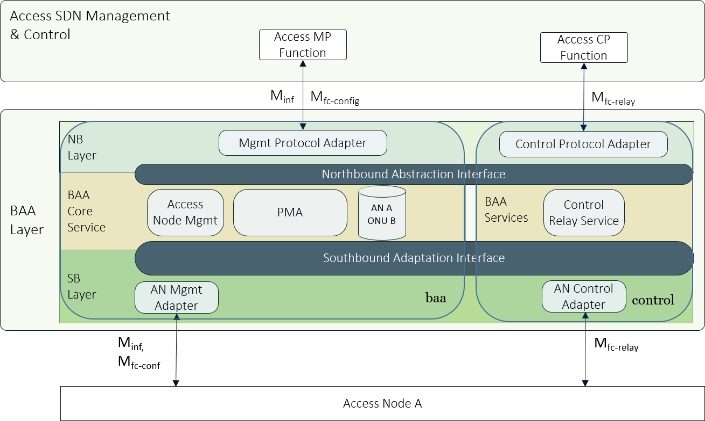
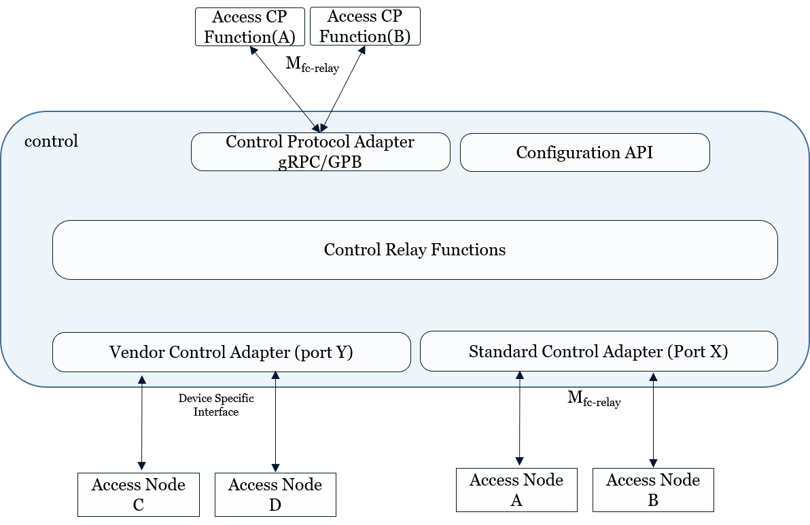
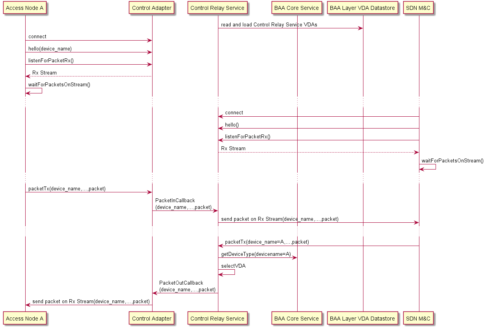
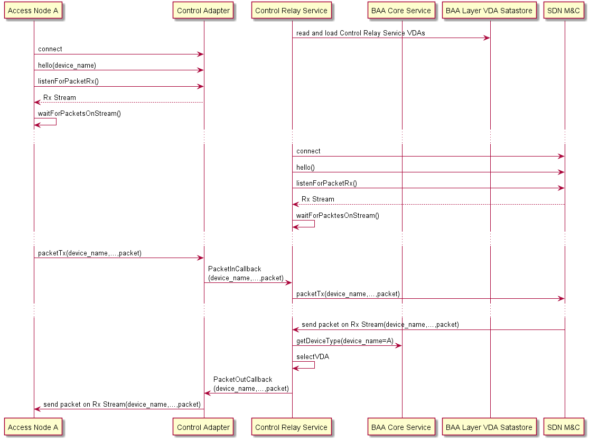
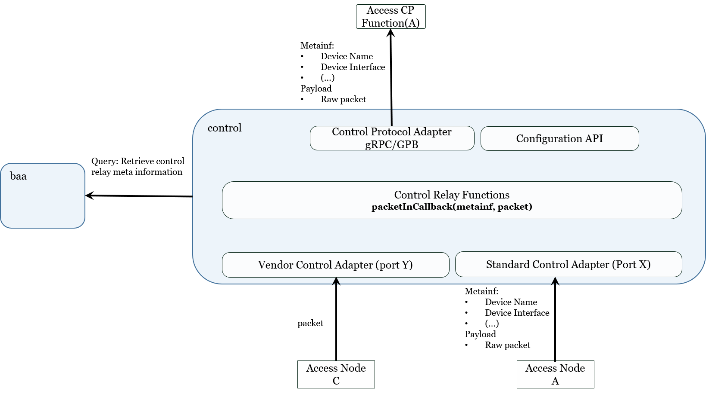
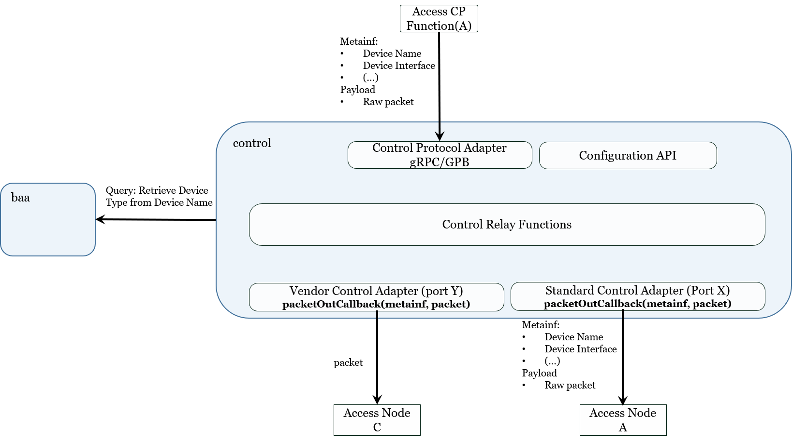

<a id="control_relay" />

# Control Relay Service

## Introduction

The control relay feature in OB-BAA provides the capability of relaying
packets from an access node to an application endpoint in the SDN
Management and Control functional layer.

The determination of which packets are relayed between the access node
and SDN M&C application endpoint is configurable through the M<sub>fc-conf</sub>
reference point.

The reference architecture with the relevant interfaces is depicted
below:

<p align="center">
 
</p>

The relevant reference for the control relay is the following:

-   M<sub>fc-conf</sub>: This reference point is used to configure the rules and
    policies used by the access node to intercept packets received by
    the access node and dispositions the packet toward BAA Layer. As
    part of the policy, the disposition of the intercepted packet is
    defined (e.g., copy packet, redirect packet). Additionally the
    reference point exposes the operational information and
    notifications needed to monitor the control relay functionality
    within the access node.

-   M<sub>fc-relay</sub>: This reference point is used to relay packets from the
    access node to an application endpoint in the SDN M&C layer.
    Additionally the reference point can be used to transfer back
    information associated with the relayed packet. For example, the
    response to the DHCP request that was relayed from the access node
    would be relayed back to the access node using this reference point.

-   M<sub>inf</sub>: FCAPS provisioning interface on the BAA layer as well as on the 
    Access Nodes. In the scope of the Control Relay logic, this interface allows to actuate 
    whatever decision taken by a higher traffic Steering Decision element upon processing of 
    the relayed packet and converted into flow configurations (L2 forwarding, QoS, etc.) to 
    enable automatic and optimal flow setup (as opposed to an infrastructural dumb pipe model).

**Info:** In this release, the administration of the Control Relay Service (e.g., SDN application endpoint connection information) is part of the microservice\'s environment variables. In a future release this information is expected to be performed using the M<sub>inf</sub> reference point.

### Use of the M<sub>inf</sub> reference point\'s model by the M<sub>fc-conf</sub> reference point\'s model

The M<sub>fc-conf</sub> reference point augments the functionality provided by
the Minf reference point. For example the L2/L3 classification rules
model defined in TR-383 is expected to be used to intercept packets
by the AN and relay to OB-BAA.
Likewise the identification and communication information associated with the OB-BAA Control Relay NB Protocol Adapter uses the same VNF remote endpoint model that is used to communicate with a vOMCI remote endpoint thus exploiting the same BAA Core service features and primitives to enrich OB-BAA with new functionalities.

### Composition of the Control Relay Service

The Control Relay Service is deployed as a micro-service that contains
the service\'s Standard and Vendor Control Adapter plugins, the Control
Relay Service functionality and the Protocol Adapter(s) that are built
into the service.

### Relaying Packets using the Control Relay Service

The BAA layer\'s Control Relay service acts as a protocol proxy that
relays packets between access nodes and SDN M&C applications by:

-   The Standard or Vendor Control Adapters receiving packets
    encapsulated within messages and then relayed to a SDN M&C
    application endpoint using Control Relay NB Protocol Adapters.

-   The Control Relay Protocol NB Adapter receiving packets encapsulated
    within messages and then relayed to a designated access node that is
    reachable via a Standard or Vendor Control Adapter.

As part of the release, the OB-BAA distribution provides gRPC/GPB based
Standard Control Adapter (SCA) and Control Relay NB Protocol Adapter for
the SB and NB layers. If an access node requires other adaptations,
vendors can provide Vendor Control Adapters (VCA).\
The following diagram depicts a deployment that uses OB-BAA provided
Control Relay NB Protocol Adapter for a SDN M&C application A while
providing the Standard and Vendor Control Adapters in the SB layer.

<p align="center">
 
</p>

In the deployment diagram above the following architectural components:

-   Control Relay Functions: Provides the functionality associated with
    the Control Relay Service that includes the packetInCallback which
    SB layer SCA and VCAs invoke whenever the adapter receives a packet
    to relay though the service.

-   Control Relay NB Protocol Adapter: Provides a gRPC protocol
    adaptation between the BAA layer and SDN M&C applications. The NB
    layer gRPC protocol Adapter provides support for connection to
    multiple northbound application instances and can transmit and
    receive Google Protocol Buffers (GPB) encapsulated control relay
    messages

-   Standard Control Adapter: Provides a gRPC protocol adaptation
    between the BAA layer and access nodes. The SCA provides support for
    connection to multiple southbound application nodes and can transmit
    and receive GPB encapsulated control relay messages.

-   Vendor Control Adapter: Each vendor can provide their own SB layer
    VCA to be used as the Control Adapter. The VCA must implement a
    packetOutCallback that the BAA Core uses whenever the BAA Core
    wishes to send a packet to a device.

#### Inter-service Communication

The Control Relay service communicates with the BAA Core service in
order to:

-   Permit the BAA Core service to:

    -   Add an SDN Application endpoint to relay packets

    -   Provide lifecycle administration of the SCA and VCAs

-   Permit the Control Relay service to:

    -   Query the BAA Core service regarding information related to
        an access node or other information maintained by the BAA Core
        service

## Control Relay Protocol Definition and Component Interactions

Packets that are relayed between the access node and the SDN M&C
application endpoint are encapsulated within a GPB message payload. The
GPB payload is then transported using the gRPC message transfer protocol
between the BAA layer and the SDN M&C application endpoint in the
Northbound direction. In the Southbound direction, the Control adapter
determines how the packet is transferred between the BAA layer and the
access node. The OB-BAA distribution provides a SCA that uses the same
message definitions as the Control Relay service\'s Control Relay NB
protocol adapter.

### Control Relay Service NB gRPC/GPB Protocol Definition

When using the Control Relay service\'s gRPC/GPB protocol between the
BAA layer and the SDN M&C application endpoint, the Control Relay
service can transfer packets that are encapsulated within GPB messages
based on the following schema:

```
service ControlRelayHelloService {
  rpc Hello (HelloRequest) returns (HelloResponse) {}
}
 
service ControlRelayPacketService {
  rpc PacketTx (ControlRelayPacket) returns (google.protobuf.Empty) {}
  rpc ListenForPacketRx (google.protobuf.Empty) returns (stream ControlRelayPacket) {} 
}
 
message ControllerHello {
}
 
message DeviceHello {
  string device_name = 1;
}
 
message HelloRequest {
  oneof local_endpoint_hello {
    ControllerHello   controller = 1;
    DeviceHello       device = 2;
  }
}
 
message HelloResponse {
  oneof remote_endpoint_hello {
    ControllerHello   controller = 1;
    DeviceHello       device = 2;
  }
}
 
message ControlRelayPacket {
  string   device_name = 1;
  string   device_interface = 2;
  string   originating_rule = 3;
 
  bytes    packet = 10;
}
```

### Access Node to BAA layer Session Establishment and Packet Relay: SDN M&C as a gRPC client

The following diagram provides and example of the how a SDN M&C
Application Endpoint would establish a session with the Control Relay
service as a gRPC client:

<p align="center">
 
</p>

In the diagram above the access node establishes a gRPC session to the
Control Relay service\'s SCA and then waits for a packet to be received.

The SDN M&C Application endpoint also establishes a gRPC session to the
Control Relay services\'s Control Relay NB Protocol Adapter and then
waits for packets to be received.

When the access node is ready to transmit a control packet, the control
packet is encapsulated within a GPB message and transmitted to the
Control Relay service; upon reception the Control Relay service forwards
the GPB message to the SDN Application endpoint.

The Application endpoint responds to the received control packet by
responding with its response payload/packet that is encapsulated with a
GPB message and transmitted to the Control Relay service; upon reception
the Control Relay service forwards the GPB message to the access node.

### Access Node to BAA layer Session Establishment and Packet Relay: SDN M&C as a gRPC server

<p align="center">
 
</p>

In the diagram above the access node establishes a gRPC session to the
Control Relay service\'s SCA and then waits for a packet to be received.

The Control Relay services\'s Control Relay NB Protocol Adapter
establishes a session to the SDN M&C Application endpoint and then waits
for packets to be received.

When the access node is ready to transmit a control packet, the control
packet is encapsulated within a GPB message and transmitted to the
Control Relay service; upon reception the Control Relay service forwards
the GPB message to the SDN Application endpoint.

The Application endpoint responds to the received control packet by
responding with its response payload/packet that is encapsulated with a
GPB message and transmitted to the Control Relay service; upon reception
the Control Relay service forwards the GPB message to the access node.

### Control Relay Service Packet Transmit Interactions
#### Access Node Packet Transmit Interaction

Packets that are transmitted between the Access Node and the Control
Relay service can use either the SCA provided by the OB-BAA distribution
or a vendor provided VCA that is plugged into the Control Relay
service.

If the access node uses the SCA, the packets are encapsulated in the GPB
messages as previously defined. Otherwise if a VCA is used, the VCA
would provide the necessary metadata (e.g., Device Name, Device
Interface) that the Control Relay service needs to formulate the message
toward the SDN Application endpoint. The BAA Core service provides APIs
to assist the VCA in obtaining information (e.g., Device Name) needed to
formulate the message to the SDN Application endpoint.

**Info:** Currently the "Device Name" is the only common attribute for all device and connection types that uniquely allows identification of an access node. For this reason, packets relayed through the SCA must include the "Device Name".

<p align="center">
 
</p>

#### SDN M&C Application Endpoint Packet Transmit Interaction

Packets that are transmitted between the SDN M&C Application endpoint
and the Control Relay service, the Control Relay service has to
determine the Control Adapter based on the contents of the
\"device\_name\" attribute in the ControlRelayPacket GPB message. Using
the contents of this attribute, the Control Relay service queries the
BAA Core service to retrieve the information necessary to select the
correct Control Adapter as defined in the [Device Adapter
Framework](../../architecture/device_adapter/index.md#device_adapter) section.

**Info:** Currently the "Device Name" is the only common attribute for all device and connection types that uniquely allows identification of an access node. For this reason, packets relayed through the SCA must include the "Device Name".

<p align="center">
 
</p>

[<--Architecture](../index.md#architecture)
