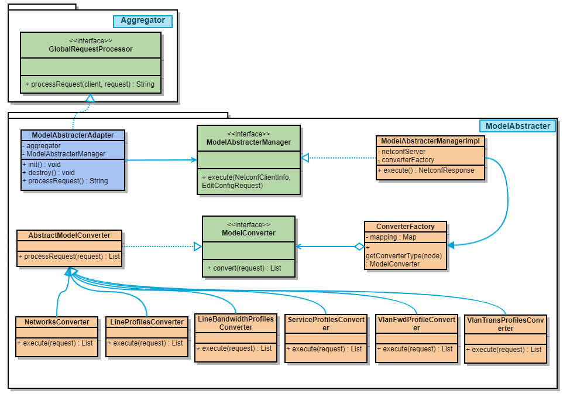

# Model Abstracter
## Introduction
The "Model Abstracter" software component provides the ability that converts some YANG models to conform to standard devices. Building on the existing architecture, the Model Abstracter Processor is created to handle specific NETCONF requests.

The functionality provided by the Model Abstracter includes the ability to:

Identifies and diverts specific requests.
Processing special YANG models and mapping them to standard models.
In addition, the Model Abstracter module is a completely optional module that can enable/disable as part of OB-BAA start-up.

The position of the Model Abstracter component in the existing architecture is depicted below:

 

## Identifies and diverts specific requests
In the existing architecture, create a Model Abstracter module where we should create a ModelAbstracterAdapter java class in. It is responsible for registering the request processor by calling the Aggregator's addProcessor API. where the request processing components register their capabilities by the schema path of the YANG model.

1. ModelAbstracterAdapter should implement GlobalRequestProcessor.
2. Focus only on namespaces of specific YANG models (New NBI YANG Model)

## Model Mapping
This is a new Maven Module that is responsible for converting YANG models. After converting, then send the standard NETCONF request to PMA.

- ModelAbstracterManager receives the NETCONF messages that are subscribed by ModelAbstracterAdapter, then distributes to the corresponding converter based on the YANG model.

## Enable/Disable Model Abstracter
This module is completely optional. We can enable/disable it when OB-BAA starts up with an environment variable named MODEL_ABSTRACTER_STATUS.

1. Add an environment variable in the docker-compose file and helm-charts file, the value MUST be Enable or Disable, and Disable is the default value.
2. The Model Abstracter will only start if the environment variable MODEL_ABSTRACTER_STATUS is defined and equals Enable.
3. Modify the startup script to support the environment variable. 

## Usage and example
Here we show you how to use the Model Abstracter and the related features of the Model Abstracter.

1. Enable/Disable Model Abstracter with env-variable MODEL_ABSTRACTER_STATUS.
2. L2 service configuration.

# Design Details
## Identifies and diverts specific requests
1. Create ModelAbstracterAdapter in Model Abstracter, which implements GlobalRequestProcessor and registers the request processor by calling the Aggregator's addProcessor API.
2. Register the capabilities by the schema path of the YANG model when the component inits.
3. After receiving the NETCONF request, send it to ModelAbstracterManager.

~~~
/*
 *   Copyright 2022 Broadband Forum
 *
 *   Licensed under the Apache License, Version 2.0 (the "License");
 *   you may not use this file except in compliance with the License.
 *   You may obtain a copy of the License at
 *
 *       http://www.apache.org/licenses/LICENSE-2.0
 *
 *   Unless required by applicable law or agreed to in writing, software
 *   distributed under the License is distributed on an "AS IS" BASIS,
 *   WITHOUT WARRANTIES OR CONDITIONS OF ANY KIND, either express or implied.
 *   See the License for the specific language governing permissions and
 *   limitations under the License.
 *
 */
 
package org.broadband_forum.obbaa.modelabstracter;
 
import lombok.extern.slf4j.Slf4j;
 
import org.apache.commons.lang3.StringUtils;
import org.broadband_forum.obbaa.aggregator.api.Aggregator;
import org.broadband_forum.obbaa.aggregator.api.DispatchException;
import org.broadband_forum.obbaa.aggregator.api.GlobalRequestProcessor;
import org.broadband_forum.obbaa.aggregator.processor.AggregatorMessage;
import org.broadband_forum.obbaa.aggregator.processor.NetconfMessageUtil;
import org.broadband_forum.obbaa.netconf.api.client.NetconfClientInfo;
import org.broadband_forum.obbaa.netconf.api.messages.DocumentToPojoTransformer;
import org.broadband_forum.obbaa.netconf.api.messages.EditConfigRequest;
import org.broadband_forum.obbaa.netconf.api.messages.NetConfResponse;
import org.broadband_forum.obbaa.netconf.api.util.NetconfResources;
import org.broadband_forum.obbaa.netconf.mn.fwk.schema.ModuleIdentifier;
import org.w3c.dom.Document;
 
import java.util.HashMap;
import java.util.Map;
import java.util.Set;
import java.util.stream.Collectors;
 
/**
 * New NBI YANG model abstracter adapter.
 */
@Slf4j
public class ModelAbstracterAdapter implements GlobalRequestProcessor {
    private static final String SEPARATOR = ":";
 
    private final Aggregator aggregator;
 
    private final ModelAbstracterManager modelAbstracterManager;
 
    private static final Map<String, String> MODEL_ADAPTER_NAMESPACES = new HashMap<String, String>() {{
        put("urn:bbf:yang:bbf-an-network-topology", "2021-09-14");
        put("urn:bbf:yang:bbf-l2-access-common", "2021-09-30");
        put("urn:bbf:yang:bbf-l2-topology", "2021-09-14");
        put("urn:bbf:yang:bbf-nt-line-profile", "2021-09-14");
        put("urn:bbf:yang:bbf-nt-service-profile", "2021-09-14");
        put("urn:bbf:yang:bbf-equipment-inventory", "2021-09-14");
    }};
 
    public ModelAbstracterAdapter(Aggregator aggregator, ModelAbstracterManager modelAbstracterManager) {
        this.aggregator = aggregator;
        this.modelAbstracterManager = modelAbstracterManager;
    }
 
    public void init() {
        try {
            Set<ModuleIdentifier> identifiers = MODEL_ADAPTER_NAMESPACES.entrySet()
                .stream()
                .map(entry -> NetconfMessageUtil.buildModuleIdentifier(
                    StringUtils.substringAfterLast(entry.getKey(), SEPARATOR), entry.getKey(), entry.getValue()))
                .collect(Collectors.toSet());
            aggregator.addProcessor(identifiers, this);
        } catch (DispatchException ex) {
            log.error("NewNbiYangModelAdapter init failed");
        }
    }
 
    public void destroy() {
        try {
            aggregator.removeProcessor(this);
        } catch (DispatchException ex) {
            log.error("NewNbiYangModelAdapter destroy failed");
        }
    }
 
    @Override
    public String processRequest(NetconfClientInfo clientInfo, String request) throws DispatchException {
        log.info("Request msg is {}.", request);
        Document document = AggregatorMessage.stringToDocument(request);
        String typeOfNetconfRequest = NetconfMessageUtil.getTypeOfNetconfRequest(document);
        // Process edit-config request only
        if (!NetconfResources.EDIT_CONFIG.equals(typeOfNetconfRequest)) {
            throw new DispatchException("Does not support the operation.");
        }
        try {
            EditConfigRequest editConfigRequest = DocumentToPojoTransformer.getEditConfig(document);
            NetConfResponse response = modelAbstracterManager.execute(clientInfo, editConfigRequest, request);
            String messageId = NetconfMessageUtil.getMessageIdFromRpcDocument(document);
            response.setMessageId(messageId);
            return response.responseToString();
        } catch (Exception e) {
            log.error("error while sending edit-config request", e);
            throw new DispatchException(e);
        }
    }
}
~~~
The ModelAbstracterManager has only one method, which is used to process requests and return responses. the following is the ModelAbstracterManager interface:

~~~
/*
 * Copyright 2022 Broadband Forum
 *
 * Licensed under the Apache License, Version 2.0 (the "License");
 * you may not use this file except in compliance with the License.
 * You may obtain a copy of the License at
 *
 *     http://www.apache.org/licenses/LICENSE-2.0
 *
 * Unless required by applicable law or agreed to in writing, software
 * distributed under the License is distributed on an "AS IS" BASIS,
 * WITHOUT WARRANTIES OR CONDITIONS OF ANY KIND, either express or implied.
 * See the License for the specific language governing permissions and
 * limitations under the License.
 */
 
package org.broadband_forum.obbaa.modelabstracter;
 
import org.broadband_forum.obbaa.netconf.api.client.NetconfClientInfo;
import org.broadband_forum.obbaa.netconf.api.messages.EditConfigRequest;
import org.broadband_forum.obbaa.netconf.api.messages.NetConfResponse;
import org.broadband_forum.obbaa.netconf.api.util.NetconfMessageBuilderException;
 
/**
 * Provide API for Aggregator to process Model Adapter message
 */
public interface ModelAbstracterManager {
    /**
     * Provide a unified API for Model Adapter RPC of Aggregator.
     *
     * @param clientInfo Client info
     * @param netconfRequest Message of Model Adapter RPC
     * @param originRequest Original message of Model Adapter RPC
     * @return Response
     */
    NetConfResponse execute(NetconfClientInfo clientInfo, EditConfigRequest netconfRequest, String originRequest)
        throws NetconfMessageBuilderException;
}
~~~
## Model Mapping
This is a new Maven Module that is responsible for converting YANG models. After converting, then send the standard NETCONF request to PMA.
1. ModelAbstracterAdapter sends requests to ModelAbstracterManager.
2. ModelAbstracter dispatches requests to the corresponding converter based on the "xmlns" of the YANG model.
3. Standard NETCONF packets are converted using the free marker template.
The interface of those converters defines a method that converts request messages to NETCONF config elements.

~~~
/*
 * Copyright 2022 Broadband Forum
 * Licensed under the Apache License, Version 2.0 (the "License");
 * you may not use this file except in compliance with the License.
 * You may obtain a copy of the License at
 *     http://www.apache.org/licenses/LICENSE-2.0
 * Unless required by applicable law or agreed to in writing, software
 * distributed under the License is distributed on an "AS IS" BASIS,
 * WITHOUT WARRANTIES OR CONDITIONS OF ANY KIND, either express or implied.
 * See the License for the specific language governing permissions and
 * limitations under the License.
 */
 
package org.broadband_forum.obbaa.modelabstracter.converter;
 
import freemarker.template.TemplateException;
 
import org.w3c.dom.Element;
 
import java.io.IOException;
import java.util.List;
 
import javax.xml.bind.JAXBException;
 
/**
 * Convert request message to corresponding config elements
 */
public interface ModelConverter {
 
    /**
     * Convert request message to Java Bean
     *
     * @param request netconf message
     * @return config elements
     */
    List<List<Element>> convert(String request) throws JAXBException, TemplateException, IOException;
}
~~~
There is also a factory method to create a corresponding converter.
~~~
/*
 * Copyright 2022 Broadband Forum
 * Licensed under the Apache License, Version 2.0 (the "License");
 * you may not use this file except in compliance with the License.
 * You may obtain a copy of the License at
 *     http://www.apache.org/licenses/LICENSE-2.0
 * Unless required by applicable law or agreed to in writing, software
 * distributed under the License is distributed on an "AS IS" BASIS,
 * WITHOUT WARRANTIES OR CONDITIONS OF ANY KIND, either express or implied.
 * See the License for the specific language governing permissions and
 * limitations under the License.
 */
 
package org.broadband_forum.obbaa.modelabstracter.converter;
 
import lombok.Setter;
 
import java.util.Map;
 
/**
 * Create converter for request.
 */
public class ConverterFactory {
    @Setter
    private Map<String, ModelConverter> mapping;
 
    /**
     * Get Java Bean type according to node name
     *
     * @param nodeName node name in config
     * @return Java Bean type
     */
    public ModelConverter getConvertType(String nodeName) {
        return mapping.get(nodeName);
    }
}  
~~~
### Freemarker Template
Freemarker is an Apache freemarker template engine, which is a Java library to generate text output based on templates and changing data. 
Templates are written in the FreeMarker Template Language (FTL), which is a simple, specialized language. Its homepage is *[here](https://freemarker.apache.org/)*.

The template files are described in the resources directory and provide a TemplateUtil as follows:
~~~
/*
 * Copyright 2022 Broadband Forum
 * Licensed under the Apache License, Version 2.0 (the "License");
 * you may not use this file except in compliance with the License.
 * You may obtain a copy of the License at
 *     http://www.apache.org/licenses/LICENSE-2.0
 * Unless required by applicable law or agreed to in writing, software
 * distributed under the License is distributed on an "AS IS" BASIS,
 * WITHOUT WARRANTIES OR CONDITIONS OF ANY KIND, either express or implied.
 * See the License for the specific language governing permissions and
 * limitations under the License.
 */
 
package org.broadband_forum.obbaa.modelabstracter.utils;
 
import freemarker.template.Configuration;
import freemarker.template.Template;
import freemarker.template.TemplateException;
import freemarker.template.TemplateExceptionHandler;
import lombok.extern.slf4j.Slf4j;
 
import java.io.File;
import java.io.IOException;
import java.io.StringWriter;
import java.net.URL;
import java.nio.charset.StandardCharsets;
import java.util.HashMap;
import java.util.Locale;
import java.util.Map;
 
/**
 * Process Template with FreeMarker
 */
@Slf4j
public final class TemplateUtils {
    private static final Configuration CFG = new Configuration(Configuration.VERSION_2_3_28);
 
    static {
        init();
    }
 
    private TemplateUtils() {
        // hide constructor
    }
 
    private static void init() {
        try {
            URL resource = TemplateUtils.class.getResource("/");
            String templatePath = resource.getPath() + "template";
            CFG.setDirectoryForTemplateLoading(new File(templatePath));
            CFG.setDefaultEncoding(StandardCharsets.UTF_8.name());
            CFG.setLocale(Locale.ROOT);
            CFG.setTemplateExceptionHandler(TemplateExceptionHandler.RETHROW_HANDLER);
        } catch (IOException e) {
            log.error("init template configuration error", e);
        }
    }
 
    /**
     * Filled the template with input values
     *
     * @param values some values in the template
     * @param templateName template's name
     * @return template's String with values
     */
    public static String processTemplate(Map<String, Object> values, String templateName)
        throws IOException, TemplateException {
        Template template = CFG.getTemplate(templateName);
        StringWriter writer = new StringWriter();
        template.process(values, writer);
        return writer.toString();
    }
}
~~~
The template util will process these templates as follows.

2-1-create-network-access-node-and-tps-in-npc.ftl 
~~~
<interfaces xmlns="urn:ietf:params:xml:ns:yang:ietf-interfaces">
  <interface>
    <name>${nniName}</name>
    <type xmlns:identityPrefix="urn:ietf:params:xml:ns:yang:iana-if-type">identityPrefix:ethernetCsmacd</type>
  </interface>
  <interface>
    <name>${uniName}</name>
    <type xmlns:identityPrefix="urn:ietf:params:xml:ns:yang:iana-if-type">identityPrefix:gpon</type>
  </interface>
</interfaces>
~~~
2-2-a-create-ani.ftl
~~~
<interfaces xmlns="urn:ietf:params:xml:ns:yang:ietf-interfaces" xmlns:bbf-xponani="urn:bbf:yang:bbf-xponani">
  <interface>
    <name>ani.${oltId}.${onuId}</name>
    <type xmlns:bbf-xpon-if-type="urn:bbf:yang:bbf-xpon-if-type">bbf-xpon-if-type:ani</type>
    <bbf-xponani:ani>
      <bbf-xponani:upstream-fec>true</bbf-xponani:upstream-fec>
      <bbf-xponani:management-gemport-aes-indicator>true</bbf-xponani:management-gemport-aes-indicator>
    </bbf-xponani:ani>
  </interface>
</interfaces>
~~~
2-2-b-create-v-ani.ftl
~~~
<interfaces xmlns="urn:ietf:params:xml:ns:yang:ietf-interfaces" xmlns:bbf-xponvani="urn:bbf:yang:bbf-xponvani">
  <interface>
    <name>v-ani.${oltId}.${onuId}</name>
    <description>v-ani</description>
    <type xmlns:bbf-xpon-if-type="urn:bbf:yang:bbf-xpon-if-type">bbf-xpon-if-type:v-ani</type>
    <enabled>true</enabled>
    <bbf-xponvani:v-ani>
      <bbf-xponvani:onu-id>101</bbf-xponvani:onu-id>
      <bbf-xponvani:channel-partition>0</bbf-xponvani:channel-partition>
      <bbf-xponvani:expected-serial-number>ABCD12345678</bbf-xponvani:expected-serial-number>
    </bbf-xponvani:v-ani>
  </interface>
</interfaces>
~~~
2-2-c-create-link-table.ftl
~~~
<link-table xmlns="urn:bbf:yang:bbf-link-table">
  <link-table>
    <from-interface>ani.${oltId}.${onuId}</from-interface>
    <to-interface>v-ani.${oltId}.${onuId}</to-interface>
  </link-table>
</link-table>
~~~
2-2-d-create-ont-eth-port.ftl
~~~
<interfaces xmlns="urn:ietf:params:xml:ns:yang:ietf-interfaces" xmlns:bbf-if-port-ref="urn:bbf:yang:bbf-interface-port-reference">
  <interface>
    <name>ethernetCsmacd.${oltId}.${onuId}.${uniTpId}</name>
    <type xmlns:iana-if-type="urn:ietf:params:xml:ns:yang:iana-if-type">iana-if-type:ethernetCsmacd</type>
    <enabled>true</enabled>
    <bbf-if-port-ref:port-layer-if>port.${oltId}.${onuId}.eth.1</bbf-if-port-ref:port-layer-if>
  </interface>
</interfaces>
~~~
2-3-0-create-band-width-profile.ftl
~~~
<bbf-xpongemtcont:xpongemtcont xmlns:bbf-xpongemtcont="urn:bbf:yang:bbf-xpongemtcont">
  <bbf-xpongemtcont:traffic-descriptor-profiles>
    <bbf-xpongemtcont:traffic-descriptor-profile>
      <bbf-xpongemtcont:name>${bandwidthProfile}</bbf-xpongemtcont:name>
      <bbf-xpongemtcont:fixed-bandwidth>${fixedBandwidth}</bbf-xpongemtcont:fixed-bandwidth>
      <bbf-xpongemtcont:assured-bandwidth>${assuredBandwidth}</bbf-xpongemtcont:assured-bandwidth>
      <bbf-xpongemtcont:maximum-bandwidth>${maximumBandwidth}</bbf-xpongemtcont:maximum-bandwidth>
    </bbf-xpongemtcont:traffic-descriptor-profile>
  </bbf-xpongemtcont:traffic-descriptor-profiles>
</bbf-xpongemtcont:xpongemtcont>
~~~
2-3-1-a-line-profile-create-t-cont.ftl
~~~
<bbf-xpongemtcont:xpongemtcont xmlns:bbf-xpongemtcont="urn:bbf:yang:bbf-xpongemtcont">
  <bbf-xpongemtcont:tconts>
    <bbf-xpongemtcont:tcont>
      <bbf-xpongemtcont:name>tcont.${oltId}.${onuId}</bbf-xpongemtcont:name>
      <bbf-xpongemtcont:interface-reference>v-ani.${oltId}.${onuId}</bbf-xpongemtcont:interface-reference>
      <bbf-xpongemtcont:traffic-descriptor-profile-ref>${bandwidthProfile}</bbf-xpongemtcont:traffic-descriptor-profile-ref>
    </bbf-xpongemtcont:tcont>
  </bbf-xpongemtcont:tconts>
</bbf-xpongemtcont:xpongemtcont>
~~~
2-3-1-b-line-profile-create-olt-v-enet.ftl
~~~
<interfaces xmlns="urn:ietf:params:xml:ns:yang:ietf-interfaces">
  <interface>
    <name>olt-v-enet.${oltId}.${onuId}.${virtualPortName}</name>
    <type xmlns:bbf-xpon-if-type="urn:bbf:yang:bbf-xpon-if-type">bbf-xpon-if-type:olt-v-enet</type>
  </interface>
</interfaces>
~~~
2-3-1-c-line-profile-create-onu-v-enet.ftl
~~~
<interfaces xmlns="urn:ietf:params:xml:ns:yang:ietf-interfaces">
  <interface>
    <name>onu-v-enet.${oltId}.${onuId}.${virtualPortName}</name>
    <type xmlns:bbf-xpon-if-type="urn:bbf:yang:bbf-xpon-if-type">bbf-xpon-if-type:onu-v-enet</type>
  </interface>
</interfaces>

~~~
2-3-1-d-line-profile-create-link-table.ftl
~~~
<link-table xmlns="urn:bbf:yang:bbf-link-table">
  <link-table xmlns="urn:bbf:yang:bbf-link-table">
    <from-interface>onu-v-enet.${oltId}.${onuId}.${virtualPortName}</from-interface>
    <to-interface>olt-v-enet.${oltId}.${onuId}.${virtualPortName}</to-interface>
  </link-table>
</link-table>
~~~
2-3-1-e-line-profile-create-gemport.ftl
~~~
<bbf-xpongemtcont:xpongemtcont xmlns:bbf-xpongemtcont="urn:bbf:yang:bbf-xpongemtcont">
  <bbf-xpongemtcont:gemports>
    <bbf-xpongemtcont:gemport>
      <bbf-xpongemtcont:name>gemport.${oltId}.${onuId}.${virtualPortName}</bbf-xpongemtcont:name>
      <bbf-xpongemtcont:interface>olt-v-enet.${oltId}.${onuId}.${virtualPortName}</bbf-xpongemtcont:interface>
      <bbf-xpongemtcont:traffic-class>0</bbf-xpongemtcont:traffic-class>
      <bbf-xpongemtcont:downstream-aes-indicator>true</bbf-xpongemtcont:downstream-aes-indicator>
      <bbf-xpongemtcont:upstream-aes-indicator>true</bbf-xpongemtcont:upstream-aes-indicator>
      <bbf-xpongemtcont:tcont-ref>tcont.${oltId}.${onuId}</bbf-xpongemtcont:tcont-ref>
    </bbf-xpongemtcont:gemport>
  </bbf-xpongemtcont:gemports>
</bbf-xpongemtcont:xpongemtcont>
~~~
2-3-1-f-line-profile-create-gem-mapping.ftl
~~~
<interfaces xmlns="urn:ietf:params:xml:ns:yang:ietf-interfaces" xmlns:bbf-subif-tag="urn:bbf:yang:bbf-sub-interface-tagging"
            xmlns:bbf-subif="urn:bbf:yang:bbf-sub-interfaces">
  <interface>
    <name>vlan-sub-interface.${virtualPortName}</name>
    <type xmlns:bbf-if-type="urn:bbf:yang:bbf-if-type">bbf-if-type:vlan-sub-interface</type>
    <bbf-subif:subif-lower-layer>
      <bbf-subif:interface>onu-v-enet.${virtualPortName}</bbf-subif:interface>
    </bbf-subif:subif-lower-layer>
    <bbf-subif:inline-frame-processing>
      <bbf-subif:ingress-rule>
        <bbf-subif:rule>
          <bbf-subif:name>${mappingRule}</bbf-subif:name>
          <bbf-subif:priority>1</bbf-subif:priority>
          <bbf-subif:flexible-match>
            <bbf-subif-tag:match-criteria>
              <bbf-subif-tag:tag>
                <bbf-subif-tag:index>0</bbf-subif-tag:index>
                <bbf-subif-tag:dot1q-tag>
                  <bbf-subif-tag:tag-type xmlns:bbf-dot1q-types="urn:bbf:yang:bbf-dot1q-types">bbf-dot1q-types:c-vlan</bbf-subif-tag:tag-type>
                  <bbf-subif-tag:vlan-id>${vlanId}</bbf-subif-tag:vlan-id>
                  <bbf-subif-tag:pbit>any</bbf-subif-tag:pbit>
                </bbf-subif-tag:dot1q-tag>
              </bbf-subif-tag:tag>
            </bbf-subif-tag:match-criteria>
          </bbf-subif:flexible-match>
        </bbf-subif:rule>
      </bbf-subif:ingress-rule>
    </bbf-subif:inline-frame-processing>
  </interface>
</interfaces>
~~~
2-3-2-service-profile-create-port-vlan.ftl
~~~
<interfaces xmlns="urn:ietf:params:xml:ns:yang:ietf-interfaces" xmlns:bbf-subif-tag="urn:bbf:yang:bbf-sub-interface-tagging"
            xmlns:bbf-subif="urn:bbf:yang:bbf-sub-interfaces">
  <interface>
    <name>vlan-sub-interface.${oltId}.${onuId}.onteth.1</name>
    <type xmlns:bbf-if-type="urn:bbf:yang:bbf-if-type">bbf-if-type:vlan-sub-interface</type>
    <bbf-subif:subif-lower-layer>
      <bbf-subif:interface>ethernetCsmacd.${oltId}.${onuId}</bbf-subif:interface>
    </bbf-subif:subif-lower-layer>
    <bbf-subif:inline-frame-processing>
      <bbf-subif:ingress-rule>
        <bbf-subif:rule>
          <bbf-subif:name>${vlanTranslationProfileName}</bbf-subif:name>
          <bbf-subif:priority>1</bbf-subif:priority>
          <bbf-subif:flexible-match>
            <bbf-subif-tag:match-criteria>
              <bbf-subif-tag:tag>
                <bbf-subif-tag:index>0</bbf-subif-tag:index>
                <bbf-subif-tag:dot1q-tag>
                  <bbf-subif-tag:tag-type xmlns:bbf-dot1q-types="urn:bbf:yang:bbf-dot1q-types">bbf-dot1q-types:c-vlan</bbf-subif-tag:tag-type>
                  <bbf-subif-tag:vlan-id>${outTagVlanId}</bbf-subif-tag:vlan-id>
                  <bbf-subif-tag:pbit>any</bbf-subif-tag:pbit>
                </bbf-subif-tag:dot1q-tag>
              </bbf-subif-tag:tag>
            </bbf-subif-tag:match-criteria>
          </bbf-subif:flexible-match>
          <bbf-subif:ingress-rewrite>
            <bbf-subif-tag:pop-tags>${popTags}</bbf-subif-tag:pop-tags>
            <bbf-subif-tag:push-tag>
              <bbf-subif-tag:index>0</bbf-subif-tag:index>
              <bbf-subif-tag:dot1q-tag>
                <bbf-subif-tag:tag-type xmlns:bbf-dot1q-types="urn:bbf:yang:bbf-dot1q-types">bbf-dot1q-types:c-vlan</bbf-subif-tag:tag-type>
                <bbf-subif-tag:vlan-id>${pushOutTagVlanId}</bbf-subif-tag:vlan-id>
                <bbf-subif-tag:write-pbit-0 />
                <bbf-subif-tag:write-dei-0 />
              </bbf-subif-tag:dot1q-tag>
            </bbf-subif-tag:push-tag>
          </bbf-subif:ingress-rewrite>
        </bbf-subif:rule>
      </bbf-subif:ingress-rule>
    </bbf-subif:inline-frame-processing>
  </interface>
</interfaces>
~~~
3-1-a-create-vlan-sub-interface_v_uni.ftl
~~~
<interfaces xmlns="urn:ietf:params:xml:ns:yang:ietf-interfaces" xmlns:bbf-subif-tag="urn:bbf:yang:bbf-sub-interface-tagging"
            xmlns:bbf-subif="urn:bbf:yang:bbf-sub-interfaces">
  <interface>
    <name>${l2vUniName}</name>
    <type xmlns:bbf-if-type="urn:bbf:yang:bbf-if-type">bbf-if-type:vlan-sub-interface</type>
    <bbf-subif:subif-lower-layer>
      <bbf-subif:interface>olt-v-enet.${oltId}.${onuId}.${l2vUniTpRef}</bbf-subif:interface>
    </bbf-subif:subif-lower-layer>
    <bbf-subif:inline-frame-processing>
      <bbf-subif:ingress-rule>
        <bbf-subif:rule>
          <bbf-subif:name>rule1</bbf-subif:name>
          <bbf-subif:priority>1</bbf-subif:priority>
          <bbf-subif:flexible-match>
            <bbf-subif-tag:match-criteria>
              <bbf-subif-tag:tag>
                <bbf-subif-tag:index>0</bbf-subif-tag:index>
                <bbf-subif-tag:dot1q-tag>
                  <bbf-subif-tag:tag-type xmlns:bbf-dot1q-types="urn:bbf:yang:bbf-dot1q-types">bbf-dot1q-types:c-vlan</bbf-subif-tag:tag-type>
                  <bbf-subif-tag:vlan-id>${l2vUni_outTagVlanId}</bbf-subif-tag:vlan-id>
                  <bbf-subif-tag:pbit>any</bbf-subif-tag:pbit>
                </bbf-subif-tag:dot1q-tag>
              </bbf-subif-tag:tag>
            </bbf-subif-tag:match-criteria>
          </bbf-subif:flexible-match>
          <bbf-subif:ingress-rewrite>
            <bbf-subif-tag:pop-tags>1</bbf-subif-tag:pop-tags>
            <bbf-subif-tag:push-tag>
              <bbf-subif-tag:index>0</bbf-subif-tag:index>
              <bbf-subif-tag:dot1q-tag>
                <bbf-subif-tag:tag-type xmlns:bbf-dot1q-types="urn:bbf:yang:bbf-dot1q-types">bbf-dot1q-types:c-vlan</bbf-subif-tag:tag-type>
                <bbf-subif-tag:vlan-id>${l2vUni_pushOutTagVlanId}</bbf-subif-tag:vlan-id>
                <bbf-subif-tag:write-pbit-0 />
                <bbf-subif-tag:write-dei-0 />
              </bbf-subif-tag:dot1q-tag>
            </bbf-subif-tag:push-tag>
          </bbf-subif:ingress-rewrite>
        </bbf-subif:rule>
      </bbf-subif:ingress-rule>
    </bbf-subif:inline-frame-processing>
  </interface>
</interfaces>
~~~
3-1-b-create-vlan-sub-interface_v_nni.ftl
~~~
<interfaces xmlns="urn:ietf:params:xml:ns:yang:ietf-interfaces" xmlns:bbf-subif-tag="urn:bbf:yang:bbf-sub-interface-tagging"
            xmlns:bbf-subif="urn:bbf:yang:bbf-sub-interfaces">
  <interface>
    <name>${l2vUniName}</name>
    <type xmlns:bbf-if-type="urn:bbf:yang:bbf-if-type">bbf-if-type:vlan-sub-interface</type>
    <bbf-subif:subif-lower-layer>
      <bbf-subif:interface>ethernetCsmacd.${oltId}.${onuId}.${l2vNniTpRef}</bbf-subif:interface>
    </bbf-subif:subif-lower-layer>
    <bbf-subif:inline-frame-processing>
      <bbf-subif:ingress-rule>
        <bbf-subif:rule>
          <bbf-subif:name>rule1</bbf-subif:name>
          <bbf-subif:priority>1</bbf-subif:priority>
          <bbf-subif:flexible-match>
            <bbf-subif-tag:match-criteria>
              <bbf-subif-tag:tag>
                <bbf-subif-tag:index>0</bbf-subif-tag:index>
                <bbf-subif-tag:dot1q-tag>
                  <bbf-subif-tag:tag-type xmlns:bbf-dot1q-types="urn:bbf:yang:bbf-dot1q-types">bbf-dot1q-types:c-vlan</bbf-subif-tag:tag-type>
                  <bbf-subif-tag:vlan-id>${l2vNni_outTagVlanId}</bbf-subif-tag:vlan-id>
                  <bbf-subif-tag:pbit>any</bbf-subif-tag:pbit>
                </bbf-subif-tag:dot1q-tag>
              </bbf-subif-tag:tag>
            </bbf-subif-tag:match-criteria>
          </bbf-subif:flexible-match>
          <bbf-subif:ingress-rewrite>
            <bbf-subif-tag:pop-tags>${l2vNni_popTags}</bbf-subif-tag:pop-tags>
          </bbf-subif:ingress-rewrite>
        </bbf-subif:rule>
      </bbf-subif:ingress-rule>
    </bbf-subif:inline-frame-processing>
  </interface>
</interfaces>
~~~
3-2-a-create-1-1-forwarder.ftl
~~~
<bbf-l2-fwd:forwarding xmlns:bbf-l2-fwd="urn:bbf:yang:bbf-l2-forwarding">
  <bbf-l2-fwd:forwarders>
    <bbf-l2-fwd:forwarder>
      <bbf-l2-fwd:name>${fwderName}</bbf-l2-fwd:name>
      <bbf-l2-fwd:ports>
        <bbf-l2-fwd:port>
          <bbf-l2-fwd:name>${srcSubIfName}</bbf-l2-fwd:name>
          <bbf-l2-fwd:sub-interface>${srcSubIfName}</bbf-l2-fwd:sub-interface>
        </bbf-l2-fwd:port>
        <bbf-l2-fwd:port>
          <bbf-l2-fwd:name>${destSubIfName}</bbf-l2-fwd:name>
          <bbf-l2-fwd:sub-interface>${destSubIfName}</bbf-l2-fwd:sub-interface>
        </bbf-l2-fwd:port>
      </bbf-l2-fwd:ports>
    </bbf-l2-fwd:forwarder>
  </bbf-l2-fwd:forwarders>
</bbf-l2-fwd:forwarding>

~~~
3-3-1-create-vlan-tp-forwarder.ftl
~~~
<bbf-l2-fwd:forwarding xmlns:bbf-l2-fwd="urn:bbf:yang:bbf-l2-forwarding">
  <bbf-l2-fwd:forwarders>
    <bbf-l2-fwd:forwarder>
      <bbf-l2-fwd:name>${fwderName}</bbf-l2-fwd:name>
      <bbf-l2-fwd:ports>
          <#list portNames as name>
            <bbf-l2-fwd:port>
              <bbf-l2-fwd:name>${name}</bbf-l2-fwd:name>
              <bbf-l2-fwd:sub-interface>${name}</bbf-l2-fwd:sub-interface>
            </bbf-l2-fwd:port>
          </#list>
      </bbf-l2-fwd:ports>
    </bbf-l2-fwd:forwarder>
  </bbf-l2-fwd:forwarders>
</bbf-l2-fwd:forwarding>
~~~
3-3-b-create-n-1-forwarder.ftl
~~~
<bbf-l2-fwd:forwarding xmlns:bbf-l2-fwd="urn:bbf:yang:bbf-l2-forwarding">
  <bbf-l2-fwd:forwarders>
    <bbf-l2-fwd:forwarder>
      <bbf-l2-fwd:name>${vlanName}</bbf-l2-fwd:name>
      <bbf-l2-fwd:ports>
          <#list portNames as name>
            <bbf-l2-fwd:port>
              <bbf-l2-fwd:name>${name}</bbf-l2-fwd:name>
              <bbf-l2-fwd:sub-interface>${name}</bbf-l2-fwd:sub-interface>
            </bbf-l2-fwd:port>
          </#list>
      </bbf-l2-fwd:ports>
    </bbf-l2-fwd:forwarder>
  </bbf-l2-fwd:forwarders>
</bbf-l2-fwd:forwarding>
~~~

## Enable/Disable Model Abstracter

Add the environment variable in the docker-compose file, and the specific position is in the 'environment' node.

Note: The following is just a sample file to demonstrate the code position.

~~~
version: '3.5'
networks:
    baadist_default:
        driver: bridge
        name: baadist_default
services:
    baa:
        image: baa
        build: ./
        container_name: baa
        restart: always
        ports:
            - "8080:8080"
            - "5005:5005"
            - "9292:9292"
            - "4335:4335"
            - "162:162/udp"
        environment:
            - BAA_USER=admin
            - BAA_USER_PASSWORD=password
            # Possible Values for PMA_SESSION_FACTORY_TYPE are REGULAR,TRANSPARENT, Default value is REGULAR
            - PMA_SESSION_FACTORY_TYPE=REGULAR
            - MAXIMUM_ALLOWED_ADAPTER_VERSIONS=3
            - VOLTMF_NAME=vOLTMF             
            # Enable or Disable Model Abstracter, Default value is Disable
            - MODEL_ABSTRACTER_STATUS=Disable
        volumes:
            - /baa/stores:/baa/stores
        networks:
            - baadist_default
        depends_on:
          - kafka
          - zookeeper
~~~
Also the environment variable in deployment.yml in the baa helm chart should be added as follows:

~~~
apiVersion: apps/v1
kind: Deployment
metadata:
  name: baa
  namespace: obbaa
spec:
  strategy:
    type: Recreate
  replicas: 1
  selector:
    matchLabels:
      app: baa
  template:
    metadata:
      labels:
        app: baa
    spec:
      volumes:
        - name: baa-store
          persistentVolumeClaim:
            claimName: baa-pvclaim
      hostname: baa
      containers:
        - name: baa
          image: {{.Values.image.repository}}:{{.Values.global.image.tag}}
          imagePullPolicy: {{.Values.global.image.pullPolicy}}
          ports:
            - name: http
              containerPort: 8080
              protocol: TCP
            - name: debug
              containerPort: 5005
              protocol: TCP
            - name: ncnbissh
              containerPort: 9292
              protocol: TCP
            - name: callhometls
              containerPort: 4335
              protocol: TCP
            - name: snmp
              containerPort: 162
              protocol: UDP
          stdin: true
          tty: true
          env:
            - name: BAA_USER
              value: admin
            - name: BAA_USER_PASSWORD
              value: password
            - name: PMA_SESSION_FACTORY_TYPE
              value: REGULAR
            - name: VOLTMF_NAME
              value: vOLTMF             
            # Enable or Disable Model Abstracter, Default value is Disable
            - name: MODEL_ABSTRACTER_STATUS
              value: Disable
          volumeMounts:
            - name: baa-store
              mountPath: /baa/stores
~~~

## Component Diagram
###  Peripheral components
The following is the component diagram with the component that interacts with the ModelAbstracter component.

 

### Class diagram
The following is the class diagram for classes relevant (implemented or used) to the Aggregator component.

 

### Sequence diagram
The following is a sequence diagram that describes the important interactions of the ModelAbstracter component.

