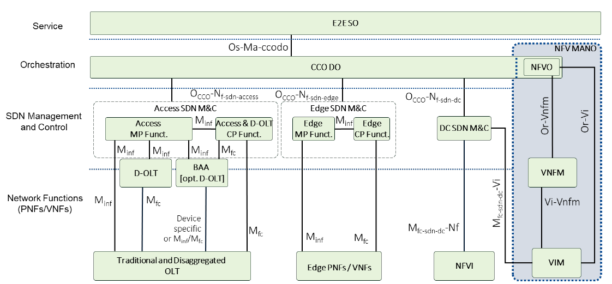
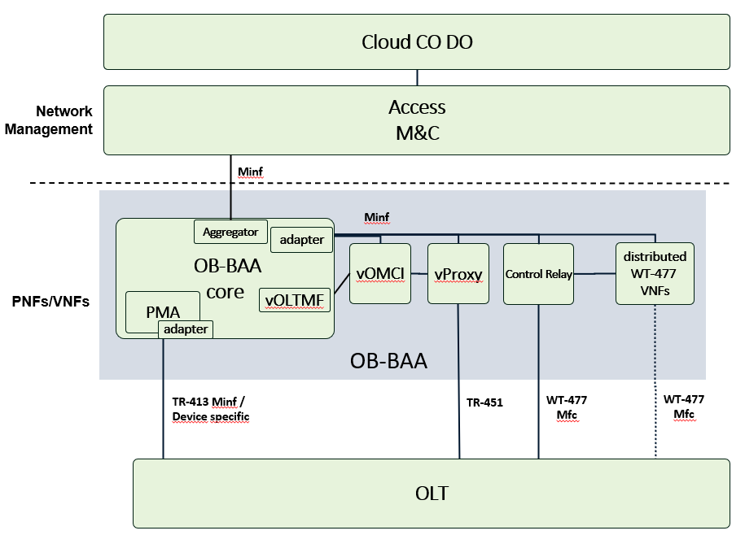
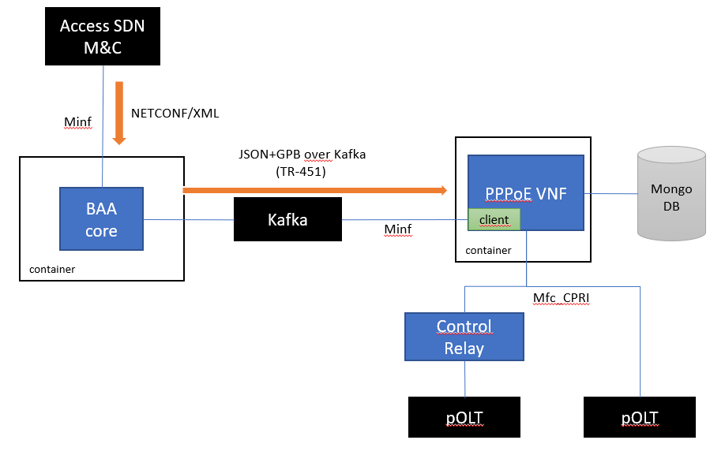

# PPPoE IA VNF
## Background
WT-477 rev 38 allows an option to deploy the D-OLT (Disaggregated OLT) into the BAA layer:

 

Source: WT-477 rev 38, Figure 2 - Disaggregated OLT in CloudCO

The list of functions that can be virtualized into the D-OLT is defined in section 4.2:

- DHCP Relay Agent
- PPPoE Intermediate Agent
- Multicast Proxy / Snooping
- ONU authentication
- vDBA
- vOMCI

OB-BAA includes a reference implementation of a PPPoE Intermediate Agent VNF conforming to WT-477.

## General architecture
The general architecture of OB-BAA with the PPPoE VNF is depicted in the figure below:

 

The aggregator component exposes the Minf interface for devices and Network Functions (including vOMCI, vProxy, and WT-477). The OB-BAA core receives the NETCONF requests from the Access SDN M&C and forwards them to the correct entity.

The adapter concept that already exists for devices can be used between the OB-BAA core and the Network Functions to support multiple protocols.

In this release, only the TR-451 MvOLTMF-vOMCI protocol (kafka based) is supported between the OB-BAA core and the Network Functions.

## Architecture of the PPPoE VNF
The PPPoE IA runs as standalone container and exposes two interfaces:

- Minf for handling the Access SDN M&C requests related to profile configuration, subscriber provisioning and monitoring
- WT-477 Mfc_CPRI for receiving PPPoE packets from the pOLT

As mentioned in the previous section, the NETCONF requests received from the Access SDN M&C are received by the BAA core and converted to JSON and sent over Kafka encoded in GPB (protobuf) to the PPPoE VNF. The PPPoE VNF exposes the YANG data model defined by WT-477 (Straw ballot).

In the southbound, the PPPoE VNF can receive packets directly from the pOLT or via Control relay using a WT-477 compliant Mfc_CPRI interface. The operations performed by the PPPoE VNF are described in WT-477 rev38, section 4.5.2 (PPPoE IA call flow).

The persistence of the PPPoE VNF data is handled by a MongoDB.

 

