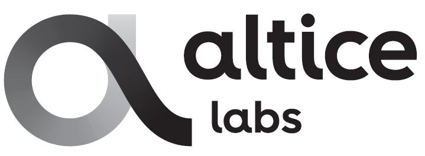
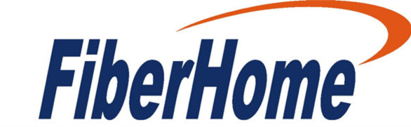
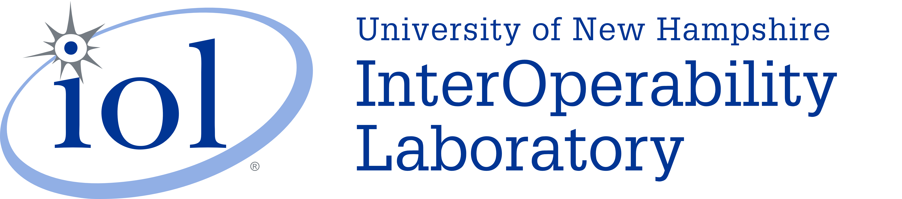

<h1>Open Broadband: Broadband Access Abstraction (OB-BAA)</h1>
<h4>Version {{ site.obbaa_release }}</h4>

**Table of Contents**

1. [Introduction](#introduction)
2. [Overview](./overview/index.md#overview)
3. [Architecture](./architecture/index.md#architecture)
4. [Installing OB-BAA](./installing/index.md#installing)
5. [Using OB-BAA](./using/index.md#using)

<a id="introduction" />

# Introduction

## Legal Notice

  The Broadband Forum is a non-profit corporation organized to create
  guidelines for broadband network system development and deployment.
  This Design Document has been approved by members of the Forum.
  This Design Document is subject to change.  This Design Document
  is copyrighted by the Broadband Forum, and all rights are reserved.
  Portions of this Design Document may be copyrighted by Broadband
  Forum members.

### Intellectual Property

  Recipients of this Design Document are requested to submit, with
  their comments, notification of any relevant patent claims or other
  intellectual property rights of which they may be aware that might
  be infringed by any implementation of this Design Document, or use
  of any software code normatively referenced in this Design Document,
  and to provide supporting documentation.

### Terms of Use

#### License

  Broadband Forum hereby grants you the right, without charge, on a
  perpetual, non-exclusive and worldwide basis, to utilize the Technical
  Report for the purpose of developing, making, having made, using,
  marketing, importing, offering to sell or license, and selling or
  licensing, and to otherwise distribute, products complying with the
  Design Document, in all cases subject to the conditions set forth
  in this notice and any relevant patent and other intellectual
  property rights of third parties (which may include members of
  Broadband Forum).  This license grant does not include the right to
  sublicense, modify or create derivative works based upon the
  Design Document except to the extent this Design Document includes
  text implementable in computer code, in which case your right under
  this License to create and modify derivative works is limited to
  modifying and creating derivative works of such code.  For the
  avoidance of doubt, except as qualified by the preceding sentence,
  products implementing this Design Document are not deemed to be
  derivative works of the Design Document.

#### NO WARRANTIES

  THIS DESIGN DOCUMENT IS BEING OFFERED WITHOUT ANY WARRANTY WHATSOEVER,
  AND IN PARTICULAR, ANY WARRANTY OF NONINFRINGEMENT IS EXPRESSLY
  DISCLAIMED. ANY USE OF THIS DESIGN DOCUMENT SHALL BE MADE ENTIRELY AT
  THE IMPLEMENTER'S OWN RISK, AND NEITHER THE BROADBAND FORUM, NOR ANY
  OF ITS MEMBERS OR SUBMITTERS, SHALL HAVE ANY LIABILITY WHATSOEVER TO
  ANY IMPLEMENTER OR THIRD PARTY FOR ANY DAMAGES OF ANY NATURE WHATSOEVER,
  DIRECTLY OR INDIRECTLY, ARISING FROM THE USE OF THIS DESIGN DOCUMENT.

#### THIRD PARTY RIGHTS

  Without limiting the generality of Section 2 above, BROADBAND FORUM
  ASSUMES NO RESPONSIBILITY TO COMPILE, CONFIRM, UPDATE OR MAKE PUBLIC
  ANY THIRD PARTY ASSERTIONS OF PATENT OR OTHER INTELLECTUAL PROPERTY
  RIGHTS THAT MIGHT NOW OR IN THE FUTURE BE INFRINGED BY AN IMPLEMENTATION
  OF THE DESIGN DOCUMENT IN ITS CURRENT, OR IN ANY FUTURE FORM. IF ANY
  SUCH RIGHTS ARE DESCRIBED ON THE DESIGN DOCUMENT, BROADBAND FORUM
  TAKES NO POSITION AS TO THE VALIDITY OR INVALIDITY OF SUCH ASSERTIONS,
  OR THAT ALL SUCH ASSERTIONS THAT HAVE OR MAY BE MADE ARE SO LISTED.

  The text of this notice must be included in all copies of this
  Design Document.

## Revision History

### Release 3

* [OB-BAA release 3.0.0 (February 2020)]({{ site.obbaa_readme }}#rel_3_0_0)

### Release 2

* [OB-BAA release 2.0.0 (February 2019)]({{ site.obbaa_readme }}#rel_2_0_0)
* [OB-BAA release 2.1.0 (July 2019)]({{ site.obbaa_readme }}#rel_2_1_0)

### Release 1

* [OB-BAA release 1.0.0 (July 2018)]({{ site.obbaa_readme }}#rel_1_0_0)
* [OB-BAA release 1.1.0 (October 2018)]({{ site.obbaa_readme }}#rel_1_1_0)

## Participants

| :---: | :---: | :---: | :---: | :---: |
|{: width="100px" height="80px"}|{: width="100px" height="100px"}|{: width="90px" height="80px"}|{: width="100px" height="100px"}|{: width="100px" height="100px"}|
|{: width="100px" height="100px"}|{: width="100px" height="100px"}|{: width="100px" height="100px"}|{: width="100px" height="100px"}|{: width="100px" height="80px"}|
|{: width="100px" height="100px"}|{: width="100px" height="60px"}|{: width="100px" height="100px"}|{: width="100px" height="100px"}|{: width="100px" height="90px"}|
|{: width="100px" height="45px"}|{: width="100px" height="60px"}|{: width="100px" height="45px"}|{: width="100px" height="60px"}||

How to Get Involved
===================

Involvement in OB-BAA requires that you sign the Broadband Forum\'s
[Contribution License Agreement (CLA)/Project Participation
Agreement](https://wiki.broadband-forum.org/download/attachments/37193235/OB-BAA%20CLA%2013Dec2017.pdf?version=1&modificationDate=1516308789992&api=v2)
(PDF), and then send the signed agreement to:

Name: [Robin Mersh](https://wiki.broadband-forum.org/display/~rmersh@broadband-forum.org)
(CEO The Broadband Forum)

Email: <rmersh@broadband-forum.org>

Phone contact: +1 303 596 7448

Issues and bugs can be submitted using the Issues feature on the OB-BAA
Github repository.

License
=======

The OB-BAA project\'s license is structure is to provide a RAND-Z (Apache 2.0) license for the program\'s
software license and keep the Broadband Forum's license for the project\'s artifacts.

Program (Software) License
-------------------------- 

The OB-BAA project is considered a RAND-Z open source project for
program deliverable (e.g, source code and associated object code). The
program deliverables use the [Apache 2.0
license](http://www.apache.org/licenses/LICENSE-2.0).

Project Artifacts
-----------------

The OB-BAA project\'s artifacts (e.g., documentation, architecture
specifications, functional behavior descriptions, Epics, Stories) use
the [Broadband Forums IPR
policy](https://www.broadband-forum.org/about-the-broadband-forum/the-bbf/intellectual-property).

Third Party Tools and License
-----------------------------
The following tools are used by the OB-BAA project

| Software Name| Purpose | Vendor | Paid/Open Source | License | Details |
| :--- | :--- | :--- | :--- |:--- | :--- |
|Netopeer2|NETCONF device simulator|CESNET|Open Source|BSD-3|<a href="https://github.com/CESNET/Netopeer2">Github link</a>|
|Atom|NETCONF client text editor|Atom|Open Source|MIT|<a href="https://atom.io">Documentation link</a>|
|atom-netconf|NETCONF package for the Atom editor|Nokia|Open Source|MIT|<a href="https://github.com/nokia/atom-netconf">Github link</a>|

The following tools are used in  and delivered by the OB-BAA project

| Software Name| Purpose | Vendor | Paid/Open Source | License | Details |
| :--- | :--- | :--- | :--- |:--- | :--- |
|HSQL DB|YANG Datastore|HyperSQL|Open Source|BSD|<a href="http://hsqldb.org/">Documentation link</a>|
|Apache Karaf|Container|Apache|Open Source|Apache 2.0|<a href="https://karaf.apache.org/">Documentation link</a>|
|JSch|Simple adapter|JCraft|Open Source|BSD|<a href="http://www.jcraft.com/jsch/">Documentation link</a>|
|SNMP4j|Sample SNMP adapter|SNMP4j|Open Source|Apache 2.0|<a href="http://www.snmp4j.org/html/documentation.html">Documentation link</a>|
|InfluxDBv2|Time series DB|InfluxData|Open Source|MIT|<a href="https://github.com/influxdata/influxdb/">Repository link</a>|

[Overview -->](./overview/index.md#overview)
