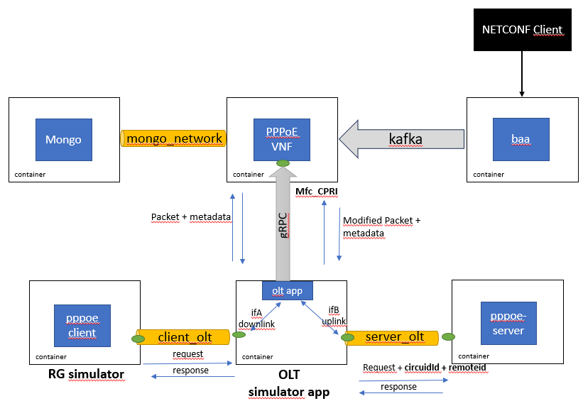
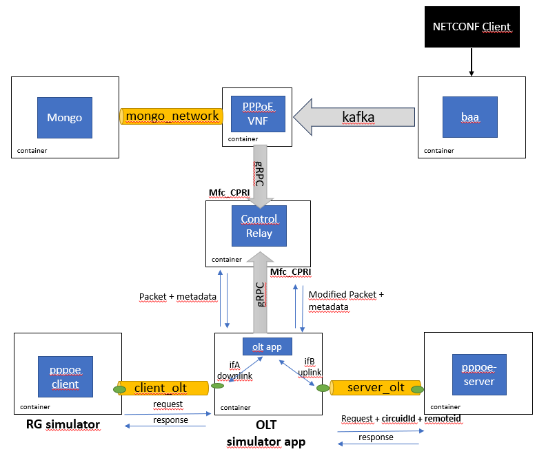

<a id="using_pppoe_vnf" />

Deploying a PPPoE VNF
====================

## Simulation and validation scenarios
There are several possible scenarios for deploying the PPPoE VNF. This section depicts those scenarios and how to simulate and validate them.

The linux PPPoE client can be used to simulate the Residential Gateway (RG): [link](https://manpages.ubuntu.com/manpages/kinetic/man8/pppoe.8.html)

The linux PPPoE server can be used as the server for the simulation/validation scenario:  [link](https://manpages.ubuntu.com/manpages/kinetic/man8/pppoe-server.8.html)

In the PPPoE VNF source code repository also an application is available to simulate the OLT. This application establishes a gRPC connection to the VNF or Control Relay (which conforms to the WT-477 Mfc_CPRI) and encapsulates the PPPoE packets generated by the PPPoE client (similar to a real OLT device).

## Direct connection of the pOLT to the D-OLT - inband

In this scenario, the PPPoE VNF connects directly to the OLT, acting as a server of it. The OLT is also connected to a PPPoE client and a PPPoE server, via the "client_olt" and the "server_olt" docker networks respectively.

The PPPoE receives configuration data from the baa via a Kafka bus, and stores said data in a mongo database, which is accessed through the "mongo_network" docker network.

 

1. From the project's root, run "cd pppoe-relay-vnf"
2. Run "docker-compose down --remove-orphans"
3. Run "sudo rm -rf /baa"
4. Run "docker-compose -f docker-compose.yml up -d --build"
5. Open two new terminals (t1 and t2)
6. On terminal t1 run "docker logs -f pppoe-relay-vnf"
7. On terminal t2 run "docker exec -it baa tail -F /baa/baa-dist-1.0.0/data/log/karaf.log"
8. Using a packet sniffer (ex: Wireshark), probe the "client_olt" and "server_olt" interfaces
9. Wait for baa to finish initializing
10. Connect netconf client to baa
11. Send the following xml document to baa

~~~
<rpc xmlns="urn:ietf:params:xml:ns:netconf:base:1.0" message-id="181">
    <edit-config>
        <target>
            <running/>
        </target>
        <config>
            <baa-network-manager:network-manager xmlns:baa-network-manager="urn:bbf:yang:obbaa:network-manager">
                <baa-network-manager:network-functions-settings>
                    <baa-network-manager:nf-client>
                        <baa-network-manager:enabled>true</baa-network-manager:enabled>
                        <baa-network-manager:nf-initiate>
                            <baa-network-manager:remote-endpoints>
                                <!-- vomci 1-->
                                <baa-network-manager:remote-endpoint>
                                    <baa-network-manager:name>pppoe-kfk-1</baa-network-manager:name>
                                    <baa-network-manager:nf-type xmlns:bbf-d-olt-nft="urn:bbf:yang:bbf-d-olt-network-function-types">bbf-d-olt-nft:d-olt-pppoeia</baa-network-manager:nf-type>
                                    <baa-network-manager:local-endpoint-name>vOLTMF_Kafka_1</baa-network-manager:local-endpoint-name>
                                    <baa-network-manager:kafka-agent>
                                        <baa-network-manager:kafka-agent-parameters>
                                            <baa-network-manager:client-id>client-id1</baa-network-manager:client-id>
                                            <baa-network-manager:publication-parameters>
                                                <baa-network-manager:topic>
                                                    <baa-network-manager:name>pppoe_relay_vnf-request</baa-network-manager:name>
                                                    <baa-network-manager:purpose>VOMCI_REQUEST</baa-network-manager:purpose>
                                                </baa-network-manager:topic>
                                            </baa-network-manager:publication-parameters>
                                            <baa-network-manager:consumption-parameters>
                                                <baa-network-manager:group-id>group-id</baa-network-manager:group-id>
                                                <baa-network-manager:topic>
                                                    <baa-network-manager:name>pppoe_relay_vnf-response</baa-network-manager:name>
                                                    <baa-network-manager:purpose>VOMCI_RESPONSE</baa-network-manager:purpose>
                                                </baa-network-manager:topic>
                                                <baa-network-manager:topic>
                                                    <baa-network-manager:name>pppoe_relay_vnf-notification</baa-network-manager:name>
                                                    <baa-network-manager:purpose>VOMCI_NOTIFICATION</baa-network-manager:purpose>
                                                </baa-network-manager:topic>
                                            </baa-network-manager:consumption-parameters>
                                        </baa-network-manager:kafka-agent-parameters>
                                    </baa-network-manager:kafka-agent>
                                    <baa-network-manager:access-point>
                                        <baa-network-manager:name>pppoe1</baa-network-manager:name>
                                        <baa-network-manager:kafka-agent>
                                            <baa-network-manager:kafka-agent-transport-parameters>
                                                <baa-network-manager:remote-address>kafka</baa-network-manager:remote-address>
                                            </baa-network-manager:kafka-agent-transport-parameters>
                                        </baa-network-manager:kafka-agent>
                                    </baa-network-manager:access-point>
                                </baa-network-manager:remote-endpoint>
 
                            </baa-network-manager:remote-endpoints>
                        </baa-network-manager:nf-initiate>
                    </baa-network-manager:nf-client>
                </baa-network-manager:network-functions-settings>
                <!-- network functions -->
                <baa-network-manager:network-functions>
                    <baa-network-manager:network-function>
                        <baa-network-manager:name>pppoe1</baa-network-manager:name>
                        <baa-network-manager:type xmlns:bbf-d-olt-nft="urn:bbf:yang:bbf-d-olt-network-function-types">bbf-d-olt-nft:d-olt-pppoeia</baa-network-manager:type>
                        <!-- must match the local endpoint name configured locally in the vOMCI function -->
                        <baa-network-manager:remote-endpoint-name>pppoe-kfk-1</baa-network-manager:remote-endpoint-name>
                    </baa-network-manager:network-function>
                </baa-network-manager:network-functions>
            </baa-network-manager:network-manager>
        </config>
    </edit-config>
</rpc>
~~~
12. Wait for terminal t1 to report kafka connection and packet received
~~~
INFO[2023-06-23T15:18:39Z] [Starting event handling thread]            
 
INFO[2023-06-23T15:19:46Z] [Received packet:
header:{msg_id:"3"  sender_name:"vOLTMF"  recipient_name:"vomci-vendor-1"  object_name:"ont1"}
...
~~~
13. Send the following xml document to baa
~~~
<rpc xmlns="urn:ietf:params:xml:ns:netconf:base:1.0" message-id="1081">
  <edit-config>
    <target>
      <running />
    </target>
    <config>
      <network-manager xmlns="urn:bbf:yang:obbaa:network-manager">
        <network-functions>
          <network-function>
            <name>pppoe1</name>
            <root>
              <d-olt-pppoe-intermediate-agent xmlns="urn:bbf:yang:bbf-d-olt-pppoe-intermediate-agent"
                                              xmlns:ct="urn:ietf:params:xml:ns:yang:ietf-crypto-types">
                <remote-nf>
                  <nf-server>
                    <enabled>true</enabled>
                    <listen>
                      <listen-endpoint>
                        <name>pppoe-grpc-1</name>
                        <grpc-server>
                          <tcp-server-parameters>
                            <local-address>0.0.0.0</local-address>
                            <local-port>9999</local-port>
                          </tcp-server-parameters>
                          <tls-server-parameters>
                            <server-identity>
                              <certificate>
                                <inline-definition>
                                  <public-key-format>ct:subject-public-key-info-format</public-key-format>
                                  <public-key>MIICIjANBgkqhkiG9w0BAQEFAAOCAg8AMIICCgKCAgEAyV332pG5j3J8B+8upBh5VOIBY3L3AfRSvD2xnqf1g1HiRY3mdQbR4D7XGic9lDKRRJ73kD+o0onGhGInc6oXpaGrdaoHWhTaEIODQFeSWAplHo/2a4Yhfu5F3XqCRJueBhqAe6p4kzHeBA+/sH1LKGqQoYqa6/COi8K9HslADtztAKUcYsK8YyOKkTdnBOAIdWhahMyO7OEkilt8DpiaBZXuU/gXpiQXPqOC/b6DpeZkf9h+auaobduqTuFe++W7OnFJl8T9DDCJySWY1fIQx9t6JiRT6fGjQkXdVPpVoWpaJKUsxQ30hFMsCXNv1O96ySs2O244UX6et+SIz2jGXaZtCJxV/q2jKb331o9q0j/Li5opWjWRqMMR0rQeOoznYtur1nbprjYP87u86PZ5wCbwYd12+R2FoFWLHYyqr6ksWlkCBYgCcWCqYwsnVIb88WB/ZaV4k2MApV4+VK6D7qiS3Ni3/nNziNMgybPpIEavsq6vqEroVITBroDC1l1vi0upp0G37eE0UsdK3QmXuMq1vNm+1ic6imtTlrp5XqhH8Ovmdjf9ix4mmmp/kWxw2i1iFEXBajZHSXN8VU+mvs6lebb0vVPe9LGgio9fkViiYAjJ5L9efnRDnOca/7aUJ8DQEHFN294hW/9d0YLjzuzSvFUBKMPdp+O6ofyVk+8CAwEAAQ==</public-key>
                                  <private-key-format>ct:rsa-private-key-format</private-key-format>
                                  <cleartext-private-key>MIIJQgIBADANBgkqhkiG9w0BAQEFAASCCSwwggkoAgEAAoICAQDJXffakbmPcnwH7y6kGHlU4gFjcvcB9FK8PbGep/WDUeJFjeZ1BtHgPtcaJz2UMpFEnveQP6jSicaEYidzqheloat1qgdaFNoQg4NAV5JYCmUej/ZrhiF+7kXdeoJEm54GGoB7qniTMd4ED7+wfUsoapChiprr8I6Lwr0eyUAO3O0ApRxiwrxjI4qRN2cE4Ah1aFqEzI7s4SSKW3wOmJoFle5T+BemJBc+o4L9voOl5mR/2H5q5qht26pO4V775bs6cUmXxP0MMInJJZjV8hDH23omJFPp8aNCRd1U+lWhalokpSzFDfSEUywJc2/U73rJKzY7bjhRfp635IjPaMZdpm0InFX+raMpvffWj2rSP8uLmilaNZGowxHStB46jOdi26vWdumuNg/zu7zo9nnAJvBh3Xb5HYWgVYsdjKqvqSxaWQIFiAJxYKpjCydUhvzxYH9lpXiTYwClXj5UroPuqJLc2Lf+c3OI0yDJs+kgRq+yrq+oSuhUhMGugMLWXW+LS6mnQbft4TRSx0rdCZe4yrW82b7WJzqKa1OWunleqEfw6+Z2N/2LHiaaan+RbHDaLWIURcFqNkdJc3xVT6a+zqV5tvS9U970saCKj1+RWKJgCMnkv15+dEOc5xr/tpQnwNAQcU3b3iFb/13RguPO7NK8VQEow92n47qh/JWT7wIDAQABAoICABG5YC4QYpViPdGS93eBIfjbNcUTovM8lqW0BnTREtaet/xoS48kbQfAcD2Ak7Z+JvQzy9WaDNmPP/Z6Dz/qik9NZiKityfyKumGMeDRdHOkYpcok8eOFFewUFz4wguY6PVfksyPyjImkwSngDdgJ+PkUVuusAkxcNKTbwMNMsK8Jm5GmjOFMYDGaZVzm3E96PCwoTsMKE5oWMeG2uoL+46fTk18ylQY3CTqzoZYJQ1OtKzeGO5+4/dbfOeZhbtFUtAHlbMypxVSFmaqlQPL3TdCNcOyseInHzgfnyYyLKRbEJkmIsUrf8i/62Hfk8nZ1GRtlcXwYyulKgJErtgWwFLouDox/vO9cCsmDpsnxRJZgs/WzPmco0KNPKjG1ib+8CQSLlkYAzAYi1t7Y8vPU36vTZpTykgrFW7TxgNvqdc+oWtXdK4gM1Lhxw0zv4A9WuwBAL+H5Dqr7GBjcogRup0/zKa/pW4wppNnGRf+EaZqxwDKp0UVvsg+Wa7QuCa8TgK6jDaICLBKvZXt6YaLrT7ZuTIj1s5a8HHMh7DpwvJj3rQPSYuuwR9qaZTivs9OquDZ1z1W/GNcK7+QpkHoxacBJFzscfyLwMNd5nhsUBrEJrEtDZGaf1ZRCmlCTOkCcZLXzn+bvMStz+KuB1JhQXEUCr+A1fTKAB719uDeyOk5AoIBAQD8Yi69CfOQJrbPxO++jFF1/ncsSk+IS3+xIq6D1ZqunEmOACIln61pbw99vG7wSigZ6tDkt0EGtfHb76QrUixwuufhmZrnqGXMDsbeUKwGl/n+K+JVQF37VA5sPrpR330tWUbv8J6yoZMviSDGZsmN5fNrrNbx3Ywa9tJgY6Qqulf0r/fRt970uuyx7JaZnqqlomVhNgMObIYyT22eBunM7O2wiViWgw3fi2xK6h6/yr5SeRvxGFNeIiGgvKNVfE/y1asPCN56i1bqcoRY7nD2RiGHrNJpqtwQdpfr5xlmCCASSOFN8gc2DMP3ep7Sh82SFacK8Enb0BmiEqUnFEkpAoIBAQDMQKRiva/85NMLlq2jnV8lNu4luCW+Nde+6fh5u+gAl5uV8ghmT+xDhZM9WJULpzeJHV6sQcYCA+W3uQVusQfNyxJY38rSs6/jmver15GKtJD19ry7yFlBo6fW3UC/zIpnagXol+VUi7/pHLnlP5I8uvGUnwVnVonJ5ffSwSolLvmT9GDl4haJsSzyFshTW5NIdzj7HzdcOatVMoRVi/1ll4EXTRilovSOSei47TR6crHpryiPhOICMHvhqwMUFJBrEqlGcm2J8O80x+TZbCFfFAC9evLHRSOVGIRW54J9nDGDpJEYHTc3+fHV31GjyS9U7sNtueeVn39iv3MCBt9XAoIBAQD1ofkrMwxCN+uku186bQa7eDY0fP57AD/+/morFTG+z40nDyosxAPaoaTKEyNF6matEsTMVS6MgXgrPkjhgNCPxtj30K/a1yJ8P8V9ibZjlHZS0hMuNb9CZMTExShBluoVwNYxoFZUNL0zfprPfiqcWDlZipaIP7+kXqTR+yhEDaidFMZ07ieouGS1pjXMvYgIPM2+lvrShvz06ikdrEzQjaeoMYRuuI5AC0oSf1n+ACzLx+NR+wLokv93mSC+ioalKR+bOl6Nlh+5fksg4rA+gHMRwTnobcpQm5uwlPM7Qp00LopZej1adYIk0srQzCtfCoPROZwou5i3DL6AElZBAoIBAGyLfdCrlbcDs9RYwvZMT5/rTSvmbMhkvL7MgCvRXD3UU+6frS8SEjDf75uOU8bZmn3XidRpL90qTQ4R2X01vzvyS1HHvHW04ChI1o4QBVx9EPxln277zdNAMZXSBvLmtDa49WLiNhF0IwyzI2ddHU4A2xlsWObN6nPNLqJl3Qvdpuyl1kjUmb2a1pPg35zM8bx0/2cU88qjKxYfvovn1UYD+ap0YkDEFMr5JCACjvzzrvDNEPUUXTdkpLEMvJoTQ5xjUmoJrYS88aJPCKMy/5kTfEE18YdMithVKx8z8Pjn5Lhc4G68N/gbcBWElFJCPFEagejx/sxY8s17iJbvKAkCggEAU5j2fW4SO/zqVY++hEFqgfsBBFpgY70w32m8O8b4K3up05spkW2fvmrzXr4COWyRO89ajUv/gzbS6f97+49+EdFAqPwVAIBywTwBE5NytexEwkdRIHaW+b4vifW6wmTNY0ZASL5gc3PzrUZvDXY04NzdZBTx2HS5UC4rHsvzqMCuLa3YTSMcmXKUrXxG032dnZ2TKwos8t5Mda5fftiWycEPQ7w5s4o/usH8kQpDZYkXF4zH9ZVmCbeOcl3R0lyrDhBLnQUTPu3UeZqT2CAeN3gdXi1M5JuLnDy3zCzm7MqQAMwbmYkw7z6zPMkRDRxq1G2F15EbpyeKgbjBTb5Zgg==</cleartext-private-key>
                                  <cert-data>MIIFoTCCA4mgAwIBAgIUC3M1Qr2xdF2/x9G/t1CsC9nt43UwDQYJKoZIhvcNAQELBQAwWjELMAkGA1UEBhMCUFQxETAPBgNVBAgMCFBvcnR1Z2FsMQwwCgYDVQQHDANBdnIxCjAIBgNVBAoMAUExCjAIBgNVBAsMAUExEjAQBgNVBAMMCWxvY2FsaG9zdDAgFw0yMzAzMDcxMTA3NTVaGA8yMTIzMDIxMTExMDc1NVowWjELMAkGA1UEBhMCUFQxETAPBgNVBAgMCFBvcnR1Z2FsMQwwCgYDVQQHDANBdnIxCjAIBgNVBAoMAUExCjAIBgNVBAsMAUExEjAQBgNVBAMMCWxvY2FsaG9zdDCCAiIwDQYJKoZIhvcNAQEBBQADggIPADCCAgoCggIBAMld99qRuY9yfAfvLqQYeVTiAWNy9wH0Urw9sZ6n9YNR4kWN5nUG0eA+1xonPZQykUSe95A/qNKJxoRiJ3OqF6Whq3WqB1oU2hCDg0BXklgKZR6P9muGIX7uRd16gkSbngYagHuqeJMx3gQPv7B9SyhqkKGKmuvwjovCvR7JQA7c7QClHGLCvGMjipE3ZwTgCHVoWoTMjuzhJIpbfA6YmgWV7lP4F6YkFz6jgv2+g6XmZH/YfmrmqG3bqk7hXvvluzpxSZfE/QwwicklmNXyEMfbeiYkU+nxo0JF3VT6VaFqWiSlLMUN9IRTLAlzb9TveskrNjtuOFF+nrfkiM9oxl2mbQicVf6toym999aPatI/y4uaKVo1kajDEdK0HjqM52Lbq9Z26a42D/O7vOj2ecAm8GHddvkdhaBVix2Mqq+pLFpZAgWIAnFgqmMLJ1SG/PFgf2WleJNjAKVePlSug+6oktzYt/5zc4jTIMmz6SBGr7Kur6hK6FSEwa6AwtZdb4tLqadBt+3hNFLHSt0Jl7jKtbzZvtYnOoprU5a6eV6oR/Dr5nY3/YseJppqf5FscNotYhRFwWo2R0lzfFVPpr7OpXm29L1T3vSxoIqPX5FYomAIyeS/Xn50Q5znGv+2lCfA0BBxTdveIVv/XdGC487s0rxVASjD3afjuqH8lZPvAgMBAAGjXTBbMAwGA1UdEwEB/wQCMAAwHQYDVR0OBBYEFFPeOIgbarcK0tDFg9oItpFjTq5yMB8GA1UdIwQYMBaAFFPeOIgbarcK0tDFg9oItpFjTq5yMAsGA1UdDwQEAwIE8DANBgkqhkiG9w0BAQsFAAOCAgEAxLfEJH4Bd40ieQrnEBmebR3O1byMo8ofFnXi5NBy0/Yal+yMwwQ2OMxzS38bhFEqN4E8rlfH5uFr3G5bI7ZRcZxJTQcn2+VoF8zQ/trQItwSmQMI9k+aTSrqOcgz+otc+6ZXZwtPnxldNbS+TBCg+g7BQ1r5RCr4/ZdM3IxlJHwXxVSV9p/wLuf+B1l/HFG3C+tJQsNjInGgnf/aoZeA5uw0EVFnQXpADngQ/5/PIbm8a8MtD6W5sfZf8pCy7kqlhMvwHtEDpXkcgtQFQNRH37MSh2fHww8v91qV743Tzdg24zA4qQ+6xW/gZJb2B1P5fOx8sOKNbaUACmu77s3SOHNZgfJ4kDdzW0Vrv//qaLJlHudVjLcJc+soe2UydhM12lUK8L97gXuP3539DagNrk2CsNY85usNt8ZB88jGvwFE63JyV0RRdqEZTjY6/mObQ0lEivpVg4G+P5nflvrAEc1d/uZPy68R6AvkVZoUUxOiD+rtRJelsInpCBzzvNgLV8J2IUWnotzVD6aVV+lsGWB1ZRjJ3/AokFiCU9Djp2EaSsvTui7SP8W9iozYhjxSQ2n+0W60xz/lDxwCYlWjadBvgIuqP/yHZlt+omFFUORnKWEnTqfi7rVvFRj84o/xGCh2bGRiCVXySiLihLpdw4k1hSmUsqQwS7mY2F8Jc+I=</cert-data>
                                </inline-definition>
                              </certificate>
                            </server-identity>
                          </tls-server-parameters>
                        </grpc-server>
                      </listen-endpoint>
                    </listen>
                  </nf-server>
                </remote-nf>
                <pppoe-profiles>
                  <pppoe-profile>
                    <name>profile1</name>
                    <pppoe-vendor-specific-tag>
                      <subtag>circuit-id</subtag>
                      <subtag>remote-id</subtag>
                      <default-circuit-id-syntax>Access-Node-Identifier eth Slot/Port/ONUID</default-circuit-id-syntax>
                      <default-remote-id-syntax>S-VID:C-VID</default-remote-id-syntax>
                    </pppoe-vendor-specific-tag>
                  </pppoe-profile>
                  <pppoe-profile>
                    <name>profile2</name>
                    <pppoe-vendor-specific-tag>
                      <subtag>circuit-id</subtag>
                      <subtag>remote-id</subtag>
                      <default-circuit-id-syntax>Access-Node-Identifier eth Slot/Port/ONUID</default-circuit-id-syntax>
                      <default-remote-id-syntax>S-VID</default-remote-id-syntax>
                    </pppoe-vendor-specific-tag>
                  </pppoe-profile>
                </pppoe-profiles>
                <devices-using-d-olt-pppoeia>
                  <device>
                    <name>olt1</name>
                    <access-node-id>an-id-olt1</access-node-id>
                    <subscriber-profiles>
                      <subscriber-profile>
                        <name>subscriber-1</name>
                        <circuit-id>olt1 eth 1/1</circuit-id>
                        <remote-id>olt1-subscriber-1</remote-id>
                      </subscriber-profile>
                      <subscriber-profile>
                        <name>subscriber-2</name>
                        <circuit-id>olt1 eth 1/1</circuit-id>
                        <remote-id>olt1-subscriber-2</remote-id>
                      </subscriber-profile>
                    </subscriber-profiles>
                    <vsi-list>
                      <vsi>
                        <vsi-name>eth0</vsi-name>
                        <subscriber-profile>subscriber-1</subscriber-profile>
                        <pppoe-profile>profile1</pppoe-profile>
                        <vlans>
                          <c-vid-on-u>10</c-vid-on-u>
                          <s-vid-on-v>200</s-vid-on-v>
                          <c-vid-on-v>20</c-vid-on-v>
                        </vlans>
                      </vsi>
                      <vsi>
                        <vsi-name>eth1</vsi-name>
                        <subscriber-profile>subscriber-2</subscriber-profile>
                        <pppoe-profile>profile1</pppoe-profile>
                        <vlans>
                          <c-vid-on-u>10</c-vid-on-u>
                          <s-vid-on-v>200</s-vid-on-v>
                          <c-vid-on-v>21</c-vid-on-v>
                        </vlans>
                      </vsi>
                      <vsi>
                        <vsi-name>vsi-subscriber-3</vsi-name>
                        <pppoe-profile>profile1</pppoe-profile>
                        <vlans>
                          <c-vid-on-u>30</c-vid-on-u>
                          <s-vid-on-v>200</s-vid-on-v>
                          <c-vid-on-v>22</c-vid-on-v>
                        </vlans>
                      </vsi>
                      <vsi>
                        <vsi-name>vsi-subscriber-4</vsi-name>
                        <pppoe-profile>profile2</pppoe-profile>
                        <vlans>
                          <c-vid-on-u>30</c-vid-on-u>
                          <s-vid-on-v>200</s-vid-on-v>
                          <c-vid-on-v>23</c-vid-on-v>
                        </vlans>
                      </vsi>
                    </vsi-list>
                  </device>
                  <device>
                    <name>olt2</name>
                    <access-node-id>an-id-olt2</access-node-id>
                    <subscriber-profiles>
                      <subscriber-profile>
                        <name>subscriber-1</name>
                        <circuit-id>olt2 eth 1/1</circuit-id>
                        <remote-id>olt2-subscriber-1</remote-id>
                      </subscriber-profile>
                      <subscriber-profile>
                        <name>subscriber-2</name>
                        <circuit-id>olt2 eth 1/1</circuit-id>
                        <remote-id>olt2-subscriber-2</remote-id>
                      </subscriber-profile>
                      <subscriber-profile>
                        <name>subscriber-3</name>
                        <circuit-id>olt2 eth 1/1</circuit-id>
                        <remote-id>olt2-subscriber-3</remote-id>
                      </subscriber-profile>
                    </subscriber-profiles>
                    <vsi-list>
                      <vsi>
                        <vsi-name>vsi-subscriber-1</vsi-name>
                        <subscriber-profile>subscriber-1</subscriber-profile>
                        <pppoe-profile>profile1</pppoe-profile>
                        <vlans>
                          <c-vid-on-u>10</c-vid-on-u>
                          <s-vid-on-v>100</s-vid-on-v>
                          <c-vid-on-v>20</c-vid-on-v>
                        </vlans>
                      </vsi>
                      <vsi>
                        <vsi-name>vsi-subscriber-2</vsi-name>
                        <subscriber-profile>subscriber-2</subscriber-profile>
                        <pppoe-profile>profile1</pppoe-profile>
                      </vsi>
                      <vsi>
                        <vsi-name>vsi-subscriber-3</vsi-name>
                        <subscriber-profile>subscriber-3</subscriber-profile>
                        <pppoe-profile>profile1</pppoe-profile>
                      </vsi>
                      <vsi>
                        <vsi-name>vsi-subscriber-4</vsi-name>
                        <pppoe-profile>profile2</pppoe-profile>
                      </vsi>
                    </vsi-list>
                  </device>
                  <device xmlns:nc="urn:ietf:params:xml:ns:netconf:base:1.0" nc:operation="remove">
                    <name>olt3</name>
                  </device>
                </devices-using-d-olt-pppoeia>
              </d-olt-pppoe-intermediate-agent>
 
 
 
            </root>
          </network-function>
        </network-functions>
      </network-manager>
    </config>
  </edit-config>
</rpc>
~~~
14. On terminal t1 wait for the following logs
~~~
INFO[2023-06-23T15:19:46Z] [Received an UpdateConfig message.]         
 
INFO[2023-06-23T15:19:46Z] [Update Config Instance Request]            
 
INFO[2023-06-23T15:19:46Z] [Handling UpdateConfig message] 
~~~
15. Now a PPPoE session should be established. If it is not, it is possible that the PPPoE client is not sending discovery packets. In that case run "docker exec -it pppoe_client bash" and "./client.sh". A PPPoE session should now be established.
The packet sniffer should have captured some PPPoE Discovery packets. Packets from the OLT to the Client/Server should have a "circuit-id" and a "remote-id" tags.

## Connection of pOLT via Control Relay
This scenario is similiar to the one above, but the PPPoE VNF and OLT comunicate through a Control Relay. The PPPoE VNF in this case is a client of the Control Relay.

 

1. From the project's root, run "cd pppoe-relay-vnf"
2. Run "docker-compose down --remove-orphans"
3. Run "sudo rm -rf /baa"
4. Run "docker-compose -f docker-compose-relay.yml up -d --build"
5. Open two new terminals (t1 and t2)
6. On terminal t1 run "docker logs -f pppoe-relay-vnf"
7. On terminal t2 run "docker exec -it baa tail -F /baa/baa-dist-1.0.0/data/log/karaf.log"
8. Using a packet sniffer (ex: Wireshark), probe the "client_olt" and "server_olt" interfaces
9. Wait for baa to finish initializing
10. Connect netconf client to baa
11. Send the following xml document to baa
~~~
rpc xmlns="urn:ietf:params:xml:ns:netconf:base:1.0" message-id="181">
    <edit-config>
        <target>
            <running/>
        </target>
        <config>
            <baa-network-manager:network-manager xmlns:baa-network-manager="urn:bbf:yang:obbaa:network-manager">
                <baa-network-manager:network-functions-settings>
                    <baa-network-manager:nf-client>
                        <baa-network-manager:enabled>true</baa-network-manager:enabled>
                        <baa-network-manager:nf-initiate>
                            <baa-network-manager:remote-endpoints>
                                <!-- vomci 1-->
                                <baa-network-manager:remote-endpoint>
                                    <baa-network-manager:name>pppoe-kfk-1</baa-network-manager:name>
                                    <baa-network-manager:nf-type xmlns:bbf-d-olt-nft="urn:bbf:yang:bbf-d-olt-network-function-types">bbf-d-olt-nft:d-olt-pppoeia</baa-network-manager:nf-type>
                                    <baa-network-manager:local-endpoint-name>vOLTMF_Kafka_1</baa-network-manager:local-endpoint-name>
                                    <baa-network-manager:kafka-agent>
                                        <baa-network-manager:kafka-agent-parameters>
                                            <baa-network-manager:client-id>client-id1</baa-network-manager:client-id>
                                            <baa-network-manager:publication-parameters>
                                                <baa-network-manager:topic>
                                                    <baa-network-manager:name>pppoe_relay_vnf-request</baa-network-manager:name>
                                                    <baa-network-manager:purpose>VOMCI_REQUEST</baa-network-manager:purpose>
                                                </baa-network-manager:topic>
                                            </baa-network-manager:publication-parameters>
                                            <baa-network-manager:consumption-parameters>
                                                <baa-network-manager:group-id>group-id</baa-network-manager:group-id>
                                                <baa-network-manager:topic>
                                                    <baa-network-manager:name>pppoe_relay_vnf-response</baa-network-manager:name>
                                                    <baa-network-manager:purpose>VOMCI_RESPONSE</baa-network-manager:purpose>
                                                </baa-network-manager:topic>
                                                <baa-network-manager:topic>
                                                    <baa-network-manager:name>pppoe_relay_vnf-notification</baa-network-manager:name>
                                                    <baa-network-manager:purpose>VOMCI_NOTIFICATION</baa-network-manager:purpose>
                                                </baa-network-manager:topic>
                                            </baa-network-manager:consumption-parameters>
                                        </baa-network-manager:kafka-agent-parameters>
                                    </baa-network-manager:kafka-agent>
                                    <baa-network-manager:access-point>
                                        <baa-network-manager:name>pppoe1</baa-network-manager:name>
                                        <baa-network-manager:kafka-agent>
                                            <baa-network-manager:kafka-agent-transport-parameters>
                                                <baa-network-manager:remote-address>kafka</baa-network-manager:remote-address>
                                            </baa-network-manager:kafka-agent-transport-parameters>
                                        </baa-network-manager:kafka-agent>
                                    </baa-network-manager:access-point>
                                </baa-network-manager:remote-endpoint>
 
                            </baa-network-manager:remote-endpoints>
                        </baa-network-manager:nf-initiate>
                    </baa-network-manager:nf-client>
                </baa-network-manager:network-functions-settings>
                <!-- network functions -->
                <baa-network-manager:network-functions>
                    <baa-network-manager:network-function>
                        <baa-network-manager:name>pppoe1</baa-network-manager:name>
                        <baa-network-manager:type xmlns:bbf-d-olt-nft="urn:bbf:yang:bbf-d-olt-network-function-types">bbf-d-olt-nft:d-olt-pppoeia</baa-network-manager:type>
                        <!-- must match the local endpoint name configured locally in the vOMCI function -->
                        <baa-network-manager:remote-endpoint-name>pppoe-kfk-1</baa-network-manager:remote-endpoint-name>
                    </baa-network-manager:network-function>
                </baa-network-manager:network-functions>
            </baa-network-manager:network-manager>
        </config>
    </edit-config>
</rpc>
~~~
12. Wait for terminal t1 to report kafka connection and packet received
~~~
INFO[2023-06-23T15:18:39Z] [Starting event handling thread]            
 
INFO[2023-06-23T15:19:46Z] [Received packet:
header:{msg_id:"3"  sender_name:"vOLTMF"  recipient_name:"vomci-vendor-1"  object_name:"ont1"}
...
~~~
13. Send the following xml document to baa
~~~
<rpc xmlns="urn:ietf:params:xml:ns:netconf:base:1.0" message-id="7009">
  <edit-config>
    <target>
      <running/>
    </target>
    <config>
      <network-manager xmlns="urn:bbf:yang:obbaa:network-manager">
        <managed-devices>
          <device xmlns:xc="urn:ietf:params:xml:ns:netconf:base:1.0" xc:operation="merge">
            <name>olt1</name>
            <device-management>
              <type>OLT</type>
              <interface-version>1.0</interface-version>
              <model>standard</model>
              <vendor>BBF</vendor>
              <push-pma-configuration-to-device>true</push-pma-configuration-to-device>
              <device-connection>
                <connection-model>direct</connection-model>
                <password-auth>
                  <authentication>
                    <address>192.1.1.1</address>
                    <management-port>10830</management-port>
                    <user-name>root</user-name>
                    <password>root</password>
                  </authentication>
                </password-auth>
              </device-connection>
            </device-management>
          </device>
        </managed-devices>
      </network-manager>
    </config>
  </edit-config>
</rpc>
~~~
At this point, packets should be arriving to the vnf and being discarded
14. Send the following xml document to baa
~~~
<rpc xmlns="urn:ietf:params:xml:ns:netconf:base:1.0" message-id="1081">
  <edit-config>
    <target>
      <running />
    </target>
    <config>
      <network-manager xmlns="urn:bbf:yang:obbaa:network-manager">
        <network-functions>
          <network-function>
            <name>pppoe1</name>
            <root>
              <d-olt-pppoe-intermediate-agent xmlns="urn:bbf:yang:bbf-d-olt-pppoe-intermediate-agent" xmlns:ct="urn:ietf:params:xml:ns:yang:ietf-crypto-types"
               xmlns:bbf-nft="urn:bbf:yang:bbf-network-function-types"
                xmlns:bbf-d-olt-nft="urn:bbf:yang:bbf-d-olt-network-function-types">
                <remote-nf>
                  <nf-client>
                    <enabled>true</enabled>
                    <initiate>
                      <remote-server>
                        <name>pppoe-grpc-2</name>
                        <nf-type>bbf-nft:vnf-type</nf-type>
                        <on-demand>false</on-demand>
                        <grpc-client>
                          <access-point>
                            <name>olt-grpc-1</name>
                            <grpc-transport-parameters>
                              <tcp-client-parameters>
                                <remote-address>1.1.1.1</remote-address>
                                <remote-port>9999</remote-port>
                              </tcp-client-parameters>
                              <tls-client-parameters>
                                  <server-authentication>
                                    <ca-certs>
                                      <inline-definition>
                                        <certificate>
                                          <name>cert1</name>
                                          <cert-data>MIIFoTCCA4mgAwIBAgIUC3M1Qr2xdF2/x9G/t1CsC9nt43UwDQYJKoZIhvcNAQELBQAwWjELMAkGA1UEBhMCUFQxETAPBgNVBAgMCFBvcnR1Z2FsMQwwCgYDVQQHDANBdnIxCjAIBgNVBAoMAUExCjAIBgNVBAsMAUExEjAQBgNVBAMMCWxvY2FsaG9zdDAgFw0yMzAzMDcxMTA3NTVaGA8yMTIzMDIxMTExMDc1NVowWjELMAkGA1UEBhMCUFQxETAPBgNVBAgMCFBvcnR1Z2FsMQwwCgYDVQQHDANBdnIxCjAIBgNVBAoMAUExCjAIBgNVBAsMAUExEjAQBgNVBAMMCWxvY2FsaG9zdDCCAiIwDQYJKoZIhvcNAQEBBQADggIPADCCAgoCggIBAMld99qRuY9yfAfvLqQYeVTiAWNy9wH0Urw9sZ6n9YNR4kWN5nUG0eA+1xonPZQykUSe95A/qNKJxoRiJ3OqF6Whq3WqB1oU2hCDg0BXklgKZR6P9muGIX7uRd16gkSbngYagHuqeJMx3gQPv7B9SyhqkKGKmuvwjovCvR7JQA7c7QClHGLCvGMjipE3ZwTgCHVoWoTMjuzhJIpbfA6YmgWV7lP4F6YkFz6jgv2+g6XmZH/YfmrmqG3bqk7hXvvluzpxSZfE/QwwicklmNXyEMfbeiYkU+nxo0JF3VT6VaFqWiSlLMUN9IRTLAlzb9TveskrNjtuOFF+nrfkiM9oxl2mbQicVf6toym999aPatI/y4uaKVo1kajDEdK0HjqM52Lbq9Z26a42D/O7vOj2ecAm8GHddvkdhaBVix2Mqq+pLFpZAgWIAnFgqmMLJ1SG/PFgf2WleJNjAKVePlSug+6oktzYt/5zc4jTIMmz6SBGr7Kur6hK6FSEwa6AwtZdb4tLqadBt+3hNFLHSt0Jl7jKtbzZvtYnOoprU5a6eV6oR/Dr5nY3/YseJppqf5FscNotYhRFwWo2R0lzfFVPpr7OpXm29L1T3vSxoIqPX5FYomAIyeS/Xn50Q5znGv+2lCfA0BBxTdveIVv/XdGC487s0rxVASjD3afjuqH8lZPvAgMBAAGjXTBbMAwGA1UdEwEB/wQCMAAwHQYDVR0OBBYEFFPeOIgbarcK0tDFg9oItpFjTq5yMB8GA1UdIwQYMBaAFFPeOIgbarcK0tDFg9oItpFjTq5yMAsGA1UdDwQEAwIE8DANBgkqhkiG9w0BAQsFAAOCAgEAxLfEJH4Bd40ieQrnEBmebR3O1byMo8ofFnXi5NBy0/Yal+yMwwQ2OMxzS38bhFEqN4E8rlfH5uFr3G5bI7ZRcZxJTQcn2+VoF8zQ/trQItwSmQMI9k+aTSrqOcgz+otc+6ZXZwtPnxldNbS+TBCg+g7BQ1r5RCr4/ZdM3IxlJHwXxVSV9p/wLuf+B1l/HFG3C+tJQsNjInGgnf/aoZeA5uw0EVFnQXpADngQ/5/PIbm8a8MtD6W5sfZf8pCy7kqlhMvwHtEDpXkcgtQFQNRH37MSh2fHww8v91qV743Tzdg24zA4qQ+6xW/gZJb2B1P5fOx8sOKNbaUACmu77s3SOHNZgfJ4kDdzW0Vrv//qaLJlHudVjLcJc+soe2UydhM12lUK8L97gXuP3539DagNrk2CsNY85usNt8ZB88jGvwFE63JyV0RRdqEZTjY6/mObQ0lEivpVg4G+P5nflvrAEc1d/uZPy68R6AvkVZoUUxOiD+rtRJelsInpCBzzvNgLV8J2IUWnotzVD6aVV+lsGWB1ZRjJ3/AokFiCU9Djp2EaSsvTui7SP8W9iozYhjxSQ2n+0W60xz/lDxwCYlWjadBvgIuqP/yHZlt+omFFUORnKWEnTqfi7rVvFRj84o/xGCh2bGRiCVXySiLihLpdw4k1hSmUsqQwS7mY2F8Jc+I=</cert-data>
                                        </certificate>
                                      </inline-definition>
                                    </ca-certs>
                                  </server-authentication>
                              </tls-client-parameters>
                            </grpc-transport-parameters>
                          </access-point>
                        </grpc-client>
                        <mfc-type>bbf-d-olt-nft:mfc-cpri</mfc-type>
                      </remote-server>
                    </initiate>
                  </nf-client>
                </remote-nf>
 
                <pppoe-profiles>
                  <pppoe-profile>
                    <name>profile1</name>
                    <pppoe-vendor-specific-tag>
                      <subtag>circuit-id</subtag>
                      <subtag>remote-id</subtag>
                      <default-circuit-id-syntax>Access-Node-Identifier eth Slot/Port/ONUID</default-circuit-id-syntax>
                      <default-remote-id-syntax>S-VID:C-VID</default-remote-id-syntax>
                    </pppoe-vendor-specific-tag>
                  </pppoe-profile>
                  <pppoe-profile>
                    <name>profile2</name>
                    <pppoe-vendor-specific-tag>
                      <subtag>circuit-id</subtag>
                      <subtag>remote-id</subtag>
                      <default-circuit-id-syntax>Access-Node-Identifier eth Slot/Port/ONUID</default-circuit-id-syntax>
                      <default-remote-id-syntax>S-VID</default-remote-id-syntax>
                    </pppoe-vendor-specific-tag>
                  </pppoe-profile>
                </pppoe-profiles>
                <devices-using-d-olt-pppoeia>
                  <device>
                    <name>olt1</name>
                    <access-node-id>an-id-olt1</access-node-id>
                    <subscriber-profiles>
                      <subscriber-profile>
                        <name>subscriber-1</name>
                        <circuit-id>olt1 eth 1/1</circuit-id>
                        <remote-id>olt1-subscriber-1</remote-id>
                      </subscriber-profile>
                      <subscriber-profile>
                        <name>subscriber-2</name>
                        <circuit-id>olt1 eth 1/1</circuit-id>
                        <remote-id>olt1-subscriber-2</remote-id>
                      </subscriber-profile>
                    </subscriber-profiles>
                    <vsi-list>
                      <vsi>
                        <vsi-name>vsi-subscriber-1</vsi-name>
                        <subscriber-profile>subscriber-1</subscriber-profile>
                        <pppoe-profile>profile1</pppoe-profile>
                      </vsi>
                      <vsi>
                        <vsi-name>vsi-subscriber-2</vsi-name>
                        <subscriber-profile>subscriber-2</subscriber-profile>
                        <pppoe-profile>profile1</pppoe-profile>
                      </vsi>
                      <vsi>
                        <vsi-name>vsi-subscriber-3</vsi-name>
                        <pppoe-profile>profile1</pppoe-profile>
                      </vsi>
                      <vsi>
                        <vsi-name>vsi-subscriber-4</vsi-name>
                        <pppoe-profile>profile2</pppoe-profile>
                      </vsi>
                    </vsi-list>
                  </device>
                  <device>
                    <name>olt2</name>
                    <access-node-id>an-id-olt2</access-node-id>
                    <subscriber-profiles>
                      <subscriber-profile>
                        <name>subscriber-1</name>
                        <circuit-id>olt2 eth 1/1</circuit-id>
                        <remote-id>olt2-subscriber-1</remote-id>
                      </subscriber-profile>
                      <subscriber-profile>
                        <name>subscriber-2</name>
                        <circuit-id>olt2 eth 1/1</circuit-id>
                        <remote-id>olt2-subscriber-2</remote-id>
                      </subscriber-profile>
                      <subscriber-profile>
                        <name>subscriber-3</name>
                        <circuit-id>olt2 eth 1/1</circuit-id>
                        <remote-id>olt2-subscriber-3</remote-id>
                      </subscriber-profile>
                    </subscriber-profiles>
                    <vsi-list>
                      <vsi>
                        <vsi-name>vsi-subscriber-1</vsi-name>
                        <subscriber-profile>subscriber-1</subscriber-profile>
                        <pppoe-profile>profile1</pppoe-profile>
                      </vsi>
                      <vsi>
                        <vsi-name>vsi-subscriber-2</vsi-name>
                        <subscriber-profile>subscriber-2</subscriber-profile>
                        <pppoe-profile>profile1</pppoe-profile>
                      </vsi>
                      <vsi>
                        <vsi-name>vsi-subscriber-3</vsi-name>
                          <subscriber-profile>subscriber-3</subscriber-profile>
                        <pppoe-profile>profile1</pppoe-profile>
                      </vsi>
                      <vsi>
                        <vsi-name>vsi-subscriber-4</vsi-name>
                        <pppoe-profile>profile2</pppoe-profile>
                      </vsi>
                    </vsi-list>
                  </device>
                  <device xmlns:nc="urn:ietf:params:xml:ns:netconf:base:1.0" nc:operation="remove">
                    <name>olt3</name>
                  </device>
                </devices-using-d-olt-pppoeia>
              </d-olt-pppoe-intermediate-agent>
 
            </root>
          </network-function>
        </network-functions>
      </network-manager>
    </config>
  </edit-config>
</rpc>
~~~
15. On terminal t1 wait for the following logs
~~~
INFO[2023-06-23T15:19:46Z] [Received an UpdateConfig message.]         
 
INFO[2023-06-23T15:19:46Z] [Update Config Instance Request]            
 
INFO[2023-06-23T15:19:46Z] [Handling UpdateConfig message]
~~~
16. Now a PPPoE session should be established. If it is not, it is possible that the PPPoE client is not sending discovery packets. In that case run "docker exec -it pppoe_client bash" and "./client.sh". A PPPoE session should now be established.
The packet sniffer should have captured some PPPoE Discovery packets. Packets from the OLT to the Client/Server should have a "circuit-id" and a "remote-id" tags.