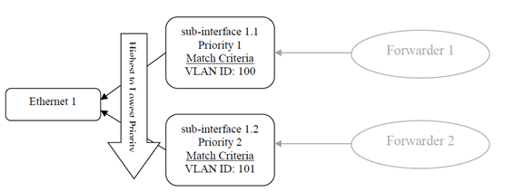

<a id="using_control_adapter" />

Using Control Adapters
=================

The OB-BAA distribution provides a Standard Control Adapter and permits
vendors to provide their own Vendor Control Adapters. These adapters are
administered as Vendor Device Adapters as defined by the [Device Adapter
Framework](../../architecture/device_adapter/index.md#device_adapter) section.

### Using the Standard Control Adapter

The SCA is currently restricted to be used on the control plane relay
feature. The SCA is pre-loaded in the BAA layer and provides a gRPC
server that listens for gRPC connections from zero or more access
nodes.

Access nodes (devices) are identified to use the SCA by the following
attributes:

-   Device Type: olt \| dpu

-   Device Vendor: bbf

-   Device Model: standard

-   Version: major.minor.patch


**Info:** Further information about this example\'s open source SOC reference implementation can be found [here](https://github.com/balapi/netconf-polt).

### Identification of a Control Adapter

The SCA and VCA follows the same naming convention as BAA Core service
Vendor Device Adapter\'s but since the Control Relay VDA is programmed
in the Go programming language with the adapter\'s plugin file
identified with the .so file extension as depicted below:

```
   <vendor>-<type>-<model>-<version>.so
```

### Functions exposed by Control Adapters

The functionality that is exposed by a Control Adapter includes the
capability to start and stop the adapter and the interface to transmit a
packet to the access node as depicted below:

```
//GPB structure of a packet generated by Google protobuf compiler for the Go programming language
type ControlRelayPacketInternal struct {
    DeviceName       string
    DeviceInterface  string
    OriginatingRule  string
    Packet            []byte
}
 
func PacketOutCallBack(packet ControlRelayPacketInternal )
func Start()
func Stop()
```

### Functions used by a Control Adapter

The functionality that is used by the Control Adapter includes the
ability to relay a received packet from the access node to/through the
Control Relay Service to SDN Application endpoint(s).

```
func PacketInCallBack(packet ControlRelayPacketInternal)
```

### Configuring an Access Node to Relay Packets (M<sub>fc-conf</sub>)

Access nodes are configured with information the access node needs to
relay packets to external endpoints, in this case the Control Relay
Service in the BAA layer.

The model that used within the Access node is based on the TR-383
classification modules for vlan-sub-interfaces.

According to TR-383 Amendment 2, section 7.1:

"*Before traffic can be forwarded, it must first be classified to
determine what to forward, where to forward and how to manipulate the
packet if so desired. The concept of a vlan-sub-interface has been
introduced for provide a VLAN interface which can be used as the source
or destination interface of a forwarding decision. Each
vlan-sub-interface classifies traffic from a particular lower layer
interface into a forwarder. This classification consists of a set of
rules specified using match criteria on to packet fields (e.g., VLAN-ID,
p-bit). The lower layer interface can be either a non-aggregated
physical or logical interface (e.g., Ethernet), an aggregation of
physical or logical interfaces (e.g., LAG) or can be another
vlan-sub-interface.*"


<p align="center">
 
</p>

**Sub-interface Example (from TR-383, figure 2)**

"*In addition to classification of traffic, [the sub-interface also
contains rules for any ingress or egress actions to take on each matched
packet]{.underline}. These actions include pushing or popping tags,
rewrite of p-bits or rewrite of Drop Eligible Indication (DEI) bits*."

As such the model (bbf-obbaa-mfc-conf) used configure the packets toward
the BAA layer\'s Control Relay service is defined below:

```
  augment /if:interfaces/if:interface/bbf-subif:frame-processing/bbf-subif:inline-frame-processing/bbf-subif:inline-frame-processing/bbf-subif:ingress-rule/bbf-subif:rule:
    +--rw control-relay! {control-relay}?
       +--rw action?                  control-relay-action
       +--rw (resulting-endpoint)?
          +--:(client-endpoint)
          |  +--rw client-endpoint    -> /remote-nf-settings/nf-client/client-parameters/nf-initiate/remote-endpoints/name {nf-client-supported}?
          +--:(server-endpoint)
             +--rw server-endpoint    -> /remote-nf-settings/nf-server/server-parameters/listen/remote-endpoints/name {nf-server-supported}?
```

If the 'control-relay' container is present, then it means that the
packets matching the sub-interface filter must be either copied or
redirected to an external entity, depending on the value of the 'action'
leaf.

The external entity is specified by an endpoint (which can act as server
or client from the connection point of view) as described below:

```
module: bbf-obbaa-mfc-conf
  +--rw remote-nf-settings!
     +--rw nf-client {nf-client-supported}?
     |  +--rw enabled?             boolean
     |  +--rw client-parameters
     |     +--rw nf-initiate!
     |        +--rw remote-endpoints* [name]
     |           +--rw name                             string
     |           +--rw type?                            string
     |           +--rw remote-endpoint
     |           |  +--rw access-points* [name]
     |           |     +--rw name          string
     |           |     +--rw (transport)
     |           |        +--:(grpc)
     |           |           +--rw grpc
     |           |              +--rw grpc-client-parameters
     |           |                 +--rw remote-address    inet:host
     |           |                 +--rw remote-port?      inet:port-number
     |           |                 +--rw local-address?    inet:ip-address {local-binding-supported}?
     |           |                 +--rw local-port?       inet:port-number {local-binding-supported}?
     |           |                 +--rw keepalives! {keepalives-supported}?
     |           |                    +--rw idle-time         uint16
     |           |                    +--rw max-probes        uint16
     |           |                    +--rw probe-interval    uint16
     |           +---n remote-endpoint-status-change
     |              +-- access-point                         -> ../../remote-endpoint/access-points/name
     |              +-- connected                            boolean
     |              +-- remote-endpoint-state-last-change    yang:date-and-time
     +--rw nf-server {nf-server-supported}?
        +--rw enabled?             boolean
        +--rw server-parameters
           +--rw listen!
              +--rw idle-timeout?       uint16
              +--rw listen-endpoint* [name]
              |  +--rw name                             string
              |  +--rw (transport)
              |  |  +--:(grpc)
              |  |     +--rw grpc
              |  |        +--rw grpc-server-parameters
              |  |           +--rw local-address    inet:ip-address
              |  |           +--rw local-port?      inet:port-number
              |  |           +--rw keepalives! {keepalives-supported}?
              |  |              +--rw idle-time         uint16
              |  |              +--rw max-probes        uint16
              |  |              +--rw probe-interval    uint16
              |  +---n remote-endpoint-status-change
              |     +-- remote-endpoint                      -> ../../../remote-endpoints/name
              |     +-- connected                            boolean
              |     +-- remote-endpoint-state-last-change    yang:date-and-time
              +--ro remote-endpoints* [name]
                 +--ro name    string
```

The OB-BAA distribution provides the YANG module
(bbf-obbaa-mfc-conf.yang) to be included in access nodes that use the
Control relay feature.  The YANG module is located in the
/resource/examples/control-relay-yang directory.

The following provides an example of how an access node can be
configured to redirect IGMP, DHCP packets from the access node to the
BAA layer\'s control micro-service:

```
<remote-nf-settings xmlns="urn:bbf:yang:obbaa:mfc-conf">
    <nf-client>
        <enabled>true</enabled>
        <client-parameters>
            <nf-initiate>
                <remote-endpoints>
                    <name>control</name>
                    <type>control-relay</type>
                    <remote-endpoint>
                        <access-points>
                            <name>control</name>
                            <grpc>
                                <grpc-client-parameters>
                                        <remote-address>www.example.com</remote-address>
                                        <remote-port>443</remote-port>
                                        <local-address>0.0.0.0</local-address>
                                        <local-port>0</local-port>
                                        <keepalives>
                                            <idle-time>15</idle-time>
                                            <max-probes>3</max-probes>
                                            <probe-interval>30</probe-interval>
                                        </keepalives>
                                </grpc-client-parameters>
                            </grpc>
                        </access-points>
                    </remote-endpoint>
                </remote-endpoints>
            </nf-initiate>
        </client-parameters>
    </nf-client>
</remote-nf-settings>

<interfaces xmlns="urn:ietf:params:xml:ns:yang:ietf-interfaces">
  <interface>
    <name>uplink_port_intf</name>
    <type xmlns:ianaift="urn:ietf:params:xml:ns:yang:iana-if-type">ianaift:ethernetCsmacd</type>
  </interface>
    	  
 <!-- Relay DHCP and IGMP packets (rule with highest priority) -->
 <interface>
	<name>capture_example1</name>
	<type xmlns:bbfift="urn:bbf:yang:bbf-if-type">bbfift:vlan-sub-interface</type>
	<subif-lower-layer xmlns="urn:bbf:yang:bbf-sub-interfaces">
	  <interface>uplink_port_intf</interface>
	</subif-lower-layer>
	<enabled>true</enabled>
	<inline-frame-processing xmlns="urn:bbf:yang:bbf-sub-interfaces">
	  <ingress-rule>
		<rule>
		  <name>rule_1</name>
		  <!--
			   This field indicates the priority for applying the
			   match criteria of this rule against the priority of
			   match criteria of other rules of this and other
			   sub-interfaces on the same parent-interface. -->
		  <priority>1</priority>
		  <flexible-match>
			<match-criteria xmlns="urn:bbf:yang:bbf-sub-interface-tagging">
			 <match-all/>
			 <protocol>dhcpv4</protocol>
			 <protocol>dhcpv6</protocol>
			 <protocol>igmp</protocol>
			</match-criteria>
		  </flexible-match>
		  <control-relay xmlns="urn:bbf:yang:obbaa:mfc-conf">
			<action>redirect</action>
			<client-endpoint>control</client-endpoint>
		  </control-relay>
		</rule>
	  </ingress-rule>
	</inline-frame-processing>
  </interface>
	
  
  <interface>
    <name>capture_example2</name>
    <type xmlns:bbfift="urn:bbf:yang:bbf-if-type">bbfift:vlan-sub-interface</type>
    <subif-lower-layer xmlns="urn:bbf:yang:bbf-sub-interfaces">
      <interface>uplink_port_intf</interface>
    </subif-lower-layer>
    <enabled>true</enabled>
   
    <!-- Relay packets destined to a specific IP on a specific VLAN -->
    <inline-frame-processing xmlns="urn:bbf:yang:bbf-sub-interfaces">
      <ingress-rule>
        <rule>
          <name>rule_1</name>
          <priority>100</priority>
          <flexible-match>
            <match-criteria xmlns="urn:bbf:yang:bbf-sub-interface-tagging">
              <ipv4-prefix>1.2.3.4/32</ipv4-prefix>
              <tag>
                <index>0</index>
                <dot1q-tag>
                  <tag-type xmlns:bbf-dot1qt="urn:bbf:yang:bbf-dot1q-types">bbf-dot1qt:c-vlan</tag-type>
                  <vlan-id>400</vlan-id>
                  <pbit>any</pbit>
                  <dei>any</dei>
                </dot1q-tag>
              </tag>
            </match-criteria>
          </flexible-match>
          <control-relay xmlns="urn:bbf:yang:obbaa:mfc-conf">
            <action>redirect</action>
            <client-endpoint>control</client-endpoint>
          </control-relay>
        </rule>
      </ingress-rule>
    </inline-frame-processing>
  </interface>
</interfaces>
```
[<--Using OB-BAA](../index.md#using)
