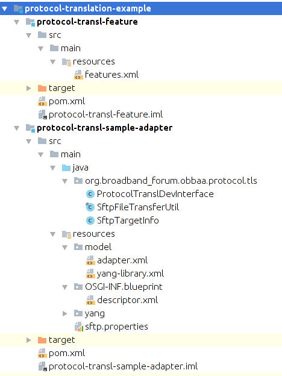
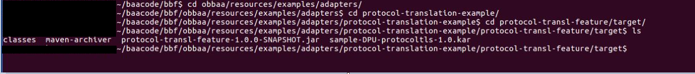

<a id="dvda" />

Creation and Deployment of Vendor Device Adapters
=================================================

Introduction
------------

This section of the document provides information on how to create and
deploy VDAs.

Vendor Device Adapters (VDA) are needed when a vendorAN

-   Has additional capabilities that is needed to be exposed to
    management and control systems or deviates from the capabilities
    provided by the SDAs for that type of device (model translation)

-   Supports a protocol that other than NETCONF (e.g., gRPC) (protocol
    translation)

Standard Device Adapters
------------------------

SDAs are device adapters that represent the standard data model for a
type of device (e.g., DPU, OLT).

This release of OB-BAA, SDAs for the DPU and OLT are available in the
obbaa/resources/models/standard-adapters directory.

The following is a example of a SDA for a DPU. Note that the SDA is
identified by its type, interfaceVersion, model and vendor attributes.

**Sample SDA device-adapter.xml**
```
<?xml version="1.0" encoding="UTF-8"?>
<Adapter type="DPU" interfaceVersion="1.0" model="standard" vendor="BBF"
         xmlns="http://www.bbf.org/obbaa/schemas/adapter/1.0"
         xmlns:xsi="http://www.w3.org/2001/XMLSchema-instance"
         xsi:schemaLocation="http://www.bbf.org/obbaa/schemas/adapter/1.0
                    ../../../../../adapter-schema-fwk/src/main/xsd/device-adapter.xsd">

    <capabilities>
        <value>urn:ietf:params:netconf:base:1.0</value>
        <value>urn:ietf:params:netconf:base:1.1</value>
        <value>urn:ietf:params:netconf:capability:writable-running:1.0</value>
        <value>urn:ietf:params:netconf:capability:notification:1.0</value>
        <value>urn:ietf:params:netconf:capability:interleave:1.0</value>
        <value>urn:ietf:params:netconf:capability:interleave:1.0</value>
    </capabilities>

</Adapter>
```

**Info:** Starting from OB-BAA R2.1.0, BAA will supports multiple versions of SDA. BAA can have up to 3 versions of same SDA that is bundled along with the BAA image.

**Note:** As there is only one SDA version available in currently release. BAA image is bundled with SDA of version 1.0

Vendor Device Adapters
----------------------

VDAs are device adapters that are specific to a vendor\'s implementation
of a type of standard device. VDAs are defined for a vendor\'s specific
version, model and type of vendor AN that is translated to a pAN that is
represented using a SDA.

Multiple instances of a vendorAN can use the same instance of a VDA,

Because a VDA is to be translated into a pAN, any request for a device
created using the VDA is validated against their corresponding SDA. If
the validation of the VDA fails against the definition of the SDA, the
creation will of the device instance will fail.

### Creation of a VDA

A VDA is comprised of 2 main artifacts - An artifact that identifies
the features of the VDA and a code bundle for each feature.

This release of OB-BAA provides 2 examples of a VDA located in the
obbaa/resources/examples/adapters directory. These examples are:

-   protocol-translation-example: Provides an example of a VDA that uses
    SFTP to convey requests to the vendorAN instance

-   model-translation-example: Provides a model that deviates from the
    SDA of that type.

The diagram below depicts the structure for protocol translation
example. Note the two artifacts (feature: protocol-transl-feature,
code: protocol-transl-sample-adapter). The adapter bundle artifact is
created as Karaf kar file.

**WARNING:** VDA naming convention
 The KAR (KAraf aRchive) file should be always named in the format vendor-type-model-interfaceVersion.kar (e.g. vendorX-OLT-T16-1.0.kar)
 -	Vendor & type should be alphabetic (both uppercase and smaller case is allowed)
 -  Model of a VDA can be of type alpha-numeric which can accept both alphabets and numbers
 -	Interface-version should be dot demarcated numerals (e.g., 1.0,1.1,2.0)


<p align="center">
 
</p>

#### VDA Adapter Bundle artifact

The example adapter bundle that we will review is located at:
obbaa/resources/examples/adapters/protocol-translation-example/protocol-transl-sample-adapter.

In this adapter bundle we see that the model and associated YANG modules
that the VDA supports is located in the adapter bundle\'s resource
directory.

-   VDA Adapter bundles model should contain a device-adapter.xml, default-config.xml and yang-library.xml that defines the
	adapter\'s capabilities. Because this is protocol translation adapter that doesn't support NETCONF, the isNetconf field is false.

    *		If the parameter stdAdapterIntVersion=2.0 is added to the device-adapter.xml of the VDA, this VDA will refer to Standard Device Adapter (SDA) of version 2.0. If this parameter is not added in the device-adapter.xml file, VDA will reference the oldest SDA Version (which is version 1.0 in current release) by default. As such the vendor should carefully select the appropriate SDA to which the VDA should reference.
    *		The default-config.xml holds the default configuration which should to be sent to the device during the first contact scenario. For example, when the device is managed with push-pma-configuration-to-device as true.

**Example device-adapter.xml for protocol tls**
```
<?xml version="1.0" encoding="UTF-8"?>
<Adapter type="DPU" interfaceVersion="1.0" model="protocol-tls" vendor="sample" stdAdapterIntVersion="1.0"
         xmlns="http://www.bbf.org/obbaa/schemas/adapter/1.0"
         xmlns:xsi="http://www.w3.org/2001/XMLSchema-instance"
         xsi:schemaLocation="http://www.bbf.org/obbaa/schemas/adapter/1.0
                    ../../../../../adapter-schema-fwk/src/main/xsd/device-adapter.xsd">

    <capabilities>
        <value>urn:ietf:params:netconf:base:1.0</value>
        <value>urn:ietf:params:netconf:base:1.1</value>
        <value>urn:ietf:params:netconf:capability:writable-running:1.0</value>
        <value>urn:ietf:params:netconf:capability:notification:1.0</value>
        <value>urn:ietf:params:netconf:capability:interleave:1.0</value>
    </capabilities>

    <developer>Sample developer for Protocol Translation</developer>
    <revisions>
        <revision>2019-01-05</revision>
        <revision>2018-12-30</revision>
    </revisions>
    <isNetconf>false</isNetconf>

</Adapter>
```

**Example default-config.xml**
```
<data>
    <if:interfaces xmlns:if="urn:ietf:params:xml:ns:yang:ietf-interfaces">
        <if:interface>
            <if:name>DSL1_PT</if:name>
            <if:type xmlns:ianaift="urn:ietf:params:xml:ns:yang:iana-if-type">ianaift:fastdsl</if:type>
            <if:description>DSL1_Description</if:description>
        </if:interface>
        <if:interface>
            <if:name>DSL2_PT</if:name>
            <if:type xmlns:ianaift="urn:ietf:params:xml:ns:yang:iana-if-type">ianaift:fastdsl</if:type>
            <if:description>DSL2_Description</if:description>
        </if:interface>
    </if:interfaces>
</data>
```

If the vendor does not want any default configuration, the default-config.xml should look as below:

**Example default-config.xml with no default configuration for VDA**
```
<data>
</data>
```

-   The VDA Adapters YANG modules are located in the yangs directory and
    contains the YANG modules from the SDA of the type of type that this
    VDA will represent. In addition, any additional YANG modules or
    deviations to YANG modules are provided in this location.

-   The VDA Adapters source code (e.g., ProtocolTranslDevInterface.java)
    provides the necessary translation logic and the VDA\'s
    implementation of the VDA Interface that was described in the
    Architectures Device Adapter Framework section of this document.  
    VDA Adapters that do not use NETCONF as their protocol need to implement the NonNCNotificationHandler object and call the handleNotification() method on receiving notifications from the device.

-   The VDA Adapters descriptor.xml is used for creation of beans and
    services for this VDA which is packaged as a Karaf bundle.

#### VDA Feature artifact

The example feature artifact that we will review is located at:
obbaa/resources/examples/adapters/protocol-translation-example/protocol-transl-feature.

In this feature artifact we see that the VDA lists the feature that
represents the VDA along with the associated adapter bundle and a
dependent 3rd party bundle.

-   features.xml defines the VDA code bundle or each feature along with
    any 3rd party bundles needed for creating the VDA. In the above
    example we needed jcraft as 3rd party dependency.

	**Features.xml example**
```
	<?xml version="1.0" encoding="UTF-8" standalone="yes"?>
	<features xmlns="http://karaf.apache.org/xmlns/features/v1.4.0" name="${project.artifactId}-${project.version}">

	    <feature name="${project.artifactId}" version="${project.version}" description="protocol translation feature">
	        <bundle>mvn:org.bbf.obbaa/protocol-transl-sample-adapter/${project.version}</bundle>
	        <bundle><![CDATA[wrap:mvn:com.jcraft/jsch/${jsch.version}$Bundle-SymbolicName=jsch&Bundle-Version=${jsch.version}]]></bundle>
	    </feature>
	</features>
```

-   pom.xml creates the Karaf kar file to be deployed.

	**pom.xml**

```
<project xmlns="http://maven.apache.org/POM/4.0.0"
         xmlns:xsi="http://www.w3.org/2001/XMLSchema-instance"
         xsi:schemaLocation="http://maven.apache.org/POM/4.0.0 http://maven.apache.org/xsd/maven-4.0.0.xsd">
    <modelVersion>4.0.0</modelVersion>

    <parent>
        <groupId>org.bbf.obbaa</groupId>
        <artifactId>protocol-translation-example</artifactId>
        <version>2.0.0</version>
    </parent>

    <groupId>org.bbf.obbaa</groupId>
    <artifactId>protocol-transl-feature</artifactId>
    <version>2.0.0</version>
    <dependencies>
        <dependency>
            <groupId>org.bbf.obbaa</groupId>
            <artifactId>protocol-transl-sample-adapter</artifactId>
            <version>${project.version}</version>
        </dependency>
    </dependencies>

    <build>
        <resources>
            <resource>
                <directory>src/main/resources</directory>
                <filtering>true</filtering>
                <includes>
                    <include>**/*.xml</include>
                </includes>
            </resource>
        </resources>
        <plugins>
            <plugin>
                <groupId>org.codehaus.mojo</groupId>
                <artifactId>build-helper-maven-plugin</artifactId>
            </plugin>
            <plugin>
                <artifactId>maven-resources-plugin</artifactId>
            </plugin>
            <plugin>
                <groupId>org.apache.karaf.tooling</groupId>
                <artifactId>karaf-maven-plugin</artifactId>
                <executions>
                    <execution>
                        <id>build-kar-from-provided-features-file</id>
                        <goals>
                            <goal>kar</goal>
                        </goals>
                        <configuration>
                            <featuresFile>${project.build.directory}/classes/features.xml</featuresFile>
                        </configuration>
                    </execution>
                </executions>
            </plugin>
            <plugin>
                <groupId>com.coderplus.maven.plugins</groupId>
                <artifactId>copy-rename-maven-plugin</artifactId>
                <version>1.0</version>
                <executions>
                    <execution>
                        <id>copy-and-rename-file</id>
                        <phase>install</phase>
                        <goals>
                            <goal>rename</goal>
                        </goals>
                        <configuration>
                            <sourceFile>${project.build.directory}/${artifactId}-${project.version}.kar</sourceFile>
                            <destinationFile>${project.build.directory}/${adapterVendor}-${adapterType}-${adapterModel}-${adapterVersion}.kar</destinationFile>
                        </configuration>
                    </execution>
                </executions>
            </plugin>
        </plugins>
    </build>
</project>
```

### Deploying a VDA

Once the VDA is created, the VDA needs to be deployed into the BAA
layer. The steps to accomplish this are:

1.  Build a Karaf kar file that represents the VDA

2.  Place the VDA into the data store for the device adapters
    (/baa/stores/deviceAdapter)

3.  Request that the BAA layer deploy the VDA into the running BAA
    layer\'s runtime environment

The following is a list of example commands and actions to deploy the
VDA into the BAA layer\'s runtime environment:

-   Ensure that the SDAs are deployed

```
Request:
<rpc message-id="101" xmlns="urn:ietf:params:xml:ns:netconf:base:1.0">
	<get>
		<filter type="subtree">
			<network-manager xmlns="urn:bbf:yang:obbaa:network-manager">
				<device-adapters xmlns="urn:bbf:yang:obbaa:network-manager">
				 <device-adapter>
					 <type/>
					 <interface-version/>
					 <model/>
					 <vendor/>
					 <is-netconf/>
				 </device-adapter>
				</device-adapters>
			</network-manager>
		</filter>
	</get>
</rpc>


Sample response: See that the SDAs are deployed:
<rpc-reply xmlns="urn:ietf:params:xml:ns:netconf:base:1.0" message-id="101">
  <data>
    <baa-network-manager:network-manager xmlns:baa-network-manager="urn:bbf:yang:obbaa:network-manager">
      <device-adapters xmlns="urn:bbf:yang:obbaa:network-manager">
        <device-adapter>
          <type>DPU</type>
          <interface-version>1.0</interface-version>
          <model>standard</model>
          <vendor>BBF</vendor>
          <is-netconf>true</is-netconf>
        </device-adapter>
        <device-adapter>
          <type>OLT</type>
          <interface-version>1.0</interface-version>
          <model>standard</model>
          <vendor>BBF</vendor>
          <is-netconf>true</is-netconf>
        </device-adapter>
      </device-adapters>
    </baa-network-manager:network-manager>
  </data>
</rpc-reply>
```

-   Build the VDA using mvn clean install in the
    obbaa/resources/examples/adapters/protocol-translation-example
    directory.
    **Warning:** The BAA micro-service must be installed and built prior to
    building the VDA. See [Installing OB-BAA](../../installing/index.md#installing)
    for instructions on how to setup the OB-BAA environment.

```
	mvn clean install
```

-   Verify that the Karaf kar file is created in the target for the
    features module:

<p align="center">
 
</p>

-   Use the above generated Karaf kar file for deployment of bundle.
    Place the Karaf kar file in /baa/stores/deviceAdapter.

-   Deploy the VDA:

```
<rpc xmlns="urn:ietf:params:xml:ns:netconf:base:1.0" message-id="10101">
	<action xmlns="urn:ietf:params:xml:ns:yang:1">
		<deploy-adapter xmlns="urn:bbf:yang:obbaa:device-adapters">
			<deploy>
				<adapter-archive>sample-DPU-protocoltls-1.0.kar</adapter-archive>
			</deploy>
		</deploy-adapter>
	</action>
</rpc>
```

-   Verify the Karaf kar file is installed properly and check if all
    related bundles are deployed properly by using the Karaf container:

	**Example of a successful VDA deployment**

```
	karaf@root()> kar:list
	KAR Name
	--------------------------------------
	protocol-transl-feature-4.1.1
	karaf@root()> list
	START LEVEL 100 , List Threshold: 50
	 ID | State  | Lvl | Version             | Name
	------------------------------------------------------------------------------------------------------------------------------------------------------------------------------
	 10 | Active |  50 | 1.59                | bcprov
	 11 | Active |  50 | 1.59                | bctls
	 22 | Active |  80 | 1.1.0               | ClassMate
	 23 | Active |  80 | 3.18.1.GA           | Javassist
	 25 | Active |  80 | 2.1.0.v201304241213 | Java Persistence API 2.1
	 32 | Active |  80 | 1.8.2.2             | Apache ServiceMix :: Bundles :: ant
	 33 | Active |  80 | 2.7.7.5             | Apache ServiceMix :: Bundles :: antlr
	 34 | Active |  80 | 1.6.1.5             | Apache ServiceMix :: Bundles :: dom4j
	 35 | Active |  80 | 1.9.2.1             | Apache ServiceMix :: Bundles :: jasypt
	 63 | Active |  80 | 4.0.4.Final         | hibernate-commons-annotations
	 64 | Active |  80 | 4.3.6.Final         | hibernate-core
	 65 | Active |  80 | 4.3.6.Final         | hibernate-entitymanager
	 66 | Active |  80 | 4.3.6.Final         | hibernate-osgi
	 67 | Active |  80 | 1.2.2.Final         | Java Annotation Indexer
	 68 | Active |  80 | 3.1.4.GA            | JBoss Logging 3
	 69 | Active |  80 | 1.0.2.Final         | JACC 1.4 API
	 70 | Active |  80 | 1.5.0               | OPS4J Base - Service Provider Access
	 71 | Active |  80 | 1.1.0               | OPS4J Pax JDBC Generic Driver Extender
	 72 | Active |  80 | 1.1.0               | OPS4J Pax JDBC Config
	 73 | Active |  80 | 1.1.0               | OPS4J Pax JDBC Pooling Support Base
	 78 | Active |  80 | 1.0.0.201505202023  | org.osgi:org.osgi.service.jdbc
	 79 | Active |  80 | 4.1.1               | Broadband Access Abstraction/Aggregator
	 80 | Active |  80 | 1.14                | animalsniffer-annotations
	 81 | Active |  80 | 1.46                | bcprov
	 82 | Active |  80 | 23.6.1.jre          | Guava: Google Core Libraries for Java
	 83 | Active |  80 | 4.1.1               | Broadband Access Abstraction/Device Adapter framework
	 84 | Active |  80 | 4.1.1               | Broadband Access Abstraction/Device Manager
	 85 | Active |  80 | 4.1.1               | Broadband Access Abstraction/Device Manager Entities
	 86 | Active |  80 | 2.4.3               | ehcache-core
	 87 | Active |  80 | 2.0.18              | errorprone-annotations
	 88 | Active |  80 | 4.1.16.Final        | Netty/Buffer
	 89 | Active |  80 | 4.1.16.Final        | Netty/Codec
	 90 | Active |  80 | 4.1.16.Final        | Netty/Common
	 91 | Active |  80 | 4.1.16.Final        | Netty/Handler
	 92 | Active |  80 | 4.1.16.Final        | Netty/Resolver
	 93 | Active |  80 | 4.1.16.Final        | Netty/Transport
	 94 | Active |  80 | 1.1                 | j2objc-annotations
	 96 | Active |  80 | 1.2.0               | CDI APIs
	 97 | Active |  80 | 1.2                 | javax.interceptor API
	 98 | Active |  80 | 3.0.1               | Java Servlet API
	 99 | Active |  80 | 1.2                 | javax.transaction API
	100 | Active |  80 | 2.0                 | javax.ws.rs-api
	101 | Active |  80 | 1.1.3               | jdom
	103 | Active |  80 | 2.8                 | Joda-Time
	104 | Active |  80 | 4.1.1               | Broadband Access Abstraction/Library Consult
	105 | Active |  80 | 4.1.1               | Broadband Access Abstraction/NBI Adapter
	106 | Active |  80 | 4.7.1               | ANTLR 4 Runtime
	117 | Active |  80 | 2.3.0               | Apache Aries JPA Container API
	118 | Active |  80 | 2.3.0               | Apache Aries JPA blueprint
	119 | Active |  80 | 2.3.0               | Apache Aries JPA container
	120 | Active |  80 | 2.3.0               | Apache Aries JPA support
	121 | Active |  80 | 1.1.1               | Apache Aries Transaction Blueprint
	122 | Active |  80 | 2.1.0               | Apache Aries Transaction Blueprint
	123 | Active |  80 | 1.3.0               | Apache Aries Transaction Manager
	124 | Active |  80 | 1.9.2               | Apache Commons BeanUtils
	125 | Active |  80 | 3.2.1               | Commons Collections
	126 | Active |  80 | 2.1.1               | Apache Commons DBCP
	127 | Active |  80 | 2.4.0               | Commons IO
	128 | Active |  80 | 1.3                 | Commons JXPath
	129 | Active |  80 | 2.6                 | Commons Lang
	130 | Active |  80 | 3.5.0               | Apache Commons Lang
	131 | Active |  80 | 2.4.2               | Apache Commons Pool
	132 | Active |  80 | 1.0.2               | Apache Felix Coordinator Service
	147 | Active |  80 | 4.0.4               | Apache Karaf :: JDBC :: Core
	159 | Active |  80 | 1.0.0.6             | Apache ServiceMix :: Bundles :: aopalliance
	160 | Active |  80 | 3.2.4.1             | Apache ServiceMix :: Bundles :: cglib
	161 | Active |  80 | 1.0.0.2             | Apache ServiceMix :: Bundles :: javax.inject
	164 | Active |  80 | 1.3.0               | Apache Mina SSHD :: Core
	166 | Active |  80 | 4.1.1               | netconf-lib/netconf-api
	167 | Active |  80 | 4.1.1               | netconf-fwk/auth-spi
	168 | Active |  80 | 4.1.1               | netconf-lib/netconf-client
	169 | Active |  80 | 4.1.1               | netconf-lib/netconf-notification-app
	170 | Active |  80 | 4.1.1               | netconf-fwk/netconf-persistence-app
	171 | Active |  80 | 4.1.1               | netconf-lib/netconf-server
	172 | Active |  80 | 4.1.1               | netconf-fwk/netconf-server-modelnode-fwk
	173 | Active |  80 | 4.1.1               | netconf-fwk/stack-api
	174 | Active |  80 | 4.1.1               | netconf-fwk/stack-logging-api
	176 | Active |  80 | 1.3.172             | H2 Database Engine
	177 | Active |  70 | 4.3.6.Final         | hibernate-ehcache
	178 | Active |  80 | 2.3.4               | HSQLDB
	180 | Active |  80 | 1.5.9.0             | MariaDB JDBC Client
	181 | Active |  80 | 2.0.11              | concepts
	182 | Active |  80 | 2.0.11              | odlext-model-api
	183 | Active |  80 | 2.0.11              | odlext-parser-support
	184 | Active |  80 | 2.0.11              | openconfig-model-api
	185 | Active |  80 | 2.0.11              | openconfig-parser-support
	186 | Active |  80 | 2.0.11              | rfc6536-model-api
	187 | Active |  80 | 2.0.11              | rfc6536-parser-support
	188 | Active |  80 | 2.0.11              | rfc7952-model-api
	189 | Active |  80 | 2.0.11              | rfc7952-parser-support
	190 | Active |  80 | 2.0.11              | rfc8040-model-api
	191 | Active |  80 | 2.0.11              | rfc8040-parser-support
	192 | Active |  80 | 1.0.11              | triemap
	193 | Active |  80 | 2.0.11              | util
	194 | Active |  80 | 2.0.11              | yang-common
	195 | Active |  80 | 2.0.11              | yang-model-api
	196 | Active |  80 | 2.0.11              | yang-model-util
	197 | Active |  80 | 2.0.11              | yang-parser-api
	198 | Active |  80 | 2.0.11              | yang-parser-impl
	199 | Active |  80 | 2.0.11              | yang-parser-reactor
	200 | Active |  80 | 2.0.11              | yang-parser-rfc7950
	201 | Active |  80 | 2.0.11              | yang-parser-spi
	202 | Active |  80 | 1.1.0               | OPS4J Pax JDBC HSQLDB Driver Adapter
	203 | Active |  80 | 1.1.0               | OPS4J Pax JDBC MariaDB Driver Adapter
	204 | Active |  80 | 1.1.0               | OPS4J Pax JDBC Pooling DBCP2
	207 | Active |  80 | 4.1.1               | Broadband Access Abstraction/Persistence Management Agent
	208 | Active |  80 | 4.1.1               | Broadband Access Abstraction/SBI Connectors
	209 | Active |  80 | 0                   | wrap_file__baa_baa-dist-4.1.1_system_com_google_errorprone_error_prone_annotations_2.1.3_error_prone_annotations-2.1.3.jar
	210 | Active |  80 | 0                   | wrap_file__baa_baa-dist-4.1.1_system_org_checkerframework_checker-compat-qual_2.0.0_checker-compat-qual-2.0.0.jar
	214 | Active |  80 | 0.1.54              | jsch
	215 | Active |  80 | 4.1.1      | Sample adapter for protocol translation
```

-   If the VDA deployment fails when we try to deploy the Karaf kar
    file, it is possible that the bundles are not deployed properly due
    to dependency issues (3rd party not resolved properly etc), improper
    descriptors or other reason. We can determine the cause by logging
    into Karaf or by looking at the logs.

    -   Use Karaf to find a Descriptor issue: no matching constructor
        found

        **Karaf login: Descriptor issue when deploying**

```
	karaf@root()> kar:list
	KAR Name
	--------------------------------------
	protocol-transl-feature-4.1.1
	karaf@root()> list | grep -v Active
	START LEVEL 100 , List Threshold: 50
	 ID | State   | Lvl | Version             | Name
	-------------------------------------------------------------------------------------------------------------------------------------------------------------------------------
	217 | Failure |  80 | 4.1.1      | Sample adapter for protocol translation
	karaf@root()> diag
	Sample adapter for protocol translation (217)
	---------------------------------------------
	Status: Failure
	Blueprint
	2/11/19 12:19 PM
	Exception:
	Unable to find a matching constructor on class org.broadband_forum.obbaa.device.adapter.CodedAdapterServiceImpl for arguments [org.apache.aries.blueprint.container.ReferenceRecipe$ServiceProxyWrapper@1a0b1639, protocol-transl-sample-adapter [217], class org.broadband_forum.obbaa.pma.DeviceXmlStore, org.apache.aries.blueprint.container.BeanRecipe$UnwrapperedBeanHolder@26c17a2d] when instanciating bean codedAdapterServiceImpl
	org.osgi.service.blueprint.container.ComponentDefinitionException: Unable to find a matching constructor on class org.broadband_forum.obbaa.device.adapter.CodedAdapterServiceImpl for arguments [org.apache.aries.blueprint.container.ReferenceRecipe$ServiceProxyWrapper@1a0b1639, protocol-transl-sample-adapter [217], class org.broadband_forum.obbaa.pma.DeviceXmlStore, org.apache.aries.blueprint.container.BeanRecipe$UnwrapperedBeanHolder@26c17a2d] when instanciating bean codedAdapterServiceImpl
	    at org.apache.aries.blueprint.container.BeanRecipe.getInstanceFromType(BeanRecipe.java:354)
	    at org.apache.aries.blueprint.container.BeanRecipe.getInstance(BeanRecipe.java:282)
	    at org.apache.aries.blueprint.container.BeanRecipe.internalCreate2(BeanRecipe.java:830)
	    at org.apache.aries.blueprint.container.BeanRecipe.internalCreate(BeanRecipe.java:811)
	    at org.apache.aries.blueprint.di.AbstractRecipe$1.call(AbstractRecipe.java:79)
	    at java.util.concurrent.FutureTask.run(FutureTask.java:266)
	    at org.apache.aries.blueprint.di.AbstractRecipe.create(AbstractRecipe.java:88)
	    at org.apache.aries.blueprint.container.BlueprintRepository.createInstances(BlueprintRepository.java:255)
	    at org.apache.aries.blueprint.container.BlueprintRepository.createAll(BlueprintRepository.java:186)
	    at org.apache.aries.blueprint.container.BlueprintContainerImpl.instantiateEagerComponents(BlueprintContainerImpl.java:712)
	    at org.apache.aries.blueprint.container.BlueprintContainerImpl.doRun(BlueprintContainerImpl.java:399)
	    at org.apache.aries.blueprint.container.BlueprintContainerImpl.run(BlueprintContainerImpl.java:273)
	    at org.apache.aries.blueprint.container.BlueprintExtender.createContainer(BlueprintExtender.java:294)
	    at org.apache.aries.blueprint.container.BlueprintExtender.createContainer(BlueprintExtender.java:263)
	    at org.apache.aries.blueprint.container.BlueprintExtender.modifiedBundle(BlueprintExtender.java:253)
	    at org.apache.aries.util.tracker.hook.BundleHookBundleTracker$Tracked.customizerModified(BundleHookBundleTracker.java:500)
	    at org.apache.aries.util.tracker.hook.BundleHookBundleTracker$Tracked.customizerModified(BundleHookBundleTracker.java:433)
	    at org.apache.aries.util.tracker.hook.BundleHookBundleTracker$AbstractTracked.track(BundleHookBundleTracker.java:725)
	    at org.apache.aries.util.tracker.hook.BundleHookBundleTracker$Tracked.bundleChanged(BundleHookBundleTracker.java:463)
	    at org.apache.aries.util.tracker.hook.BundleHookBundleTracker$BundleEventHook.event(BundleHookBundleTracker.java:422)
	    at org.apache.felix.framework.util.SecureAction.invokeBundleEventHook(SecureAction.java:1179)
	    at org.apache.felix.framework.util.EventDispatcher.createWhitelistFromHooks(EventDispatcher.java:731)
	    at org.apache.felix.framework.util.EventDispatcher.fireBundleEvent(EventDispatcher.java:486)
	    at org.apache.felix.framework.Felix.fireBundleEvent(Felix.java:4541)
	    at org.apache.felix.framework.Felix.startBundle(Felix.java:2172)
	    at org.apache.felix.framework.BundleImpl.start(BundleImpl.java:998)
	    at org.apache.felix.framework.BundleImpl.start(BundleImpl.java:984)
	    at org.apache.karaf.features.internal.service.FeaturesServiceImpl.startBundle(FeaturesServiceImpl.java:1199)
	    at org.apache.karaf.features.internal.service.Deployer.deploy(Deployer.java:840)
	    at org.apache.karaf.features.internal.service.FeaturesServiceImpl.doProvision(FeaturesServiceImpl.java:1089)
	    at org.apache.karaf.features.internal.service.FeaturesServiceImpl$1.call(FeaturesServiceImpl.java:985)
	    at java.util.concurrent.FutureTask.run(FutureTask.java:266)
	    at java.util.concurrent.ThreadPoolExecutor.runWorker(ThreadPoolExecutor.java:1142)
	    at java.util.concurrent.ThreadPoolExecutor$Worker.run(ThreadPoolExecutor.java:617)
	    at java.lang.Thread.run(Thread.java:748)
```

-   Use the Karaf log to find a Missing 3rd party dependency (e.g.,
    jcraft) that was listed in the features.xml.

    **Error due to dependency issues**

```
	2019-02-11 12:24:40,940 | INFO  | f]-nio2-thread-6 | DeviceAdapterActionHandlerImpl   | 207 - pma - 4.1.1 | Received request for deploying coded adapter protocol-transl-feature-4.1.1.kar
	2019-02-11 12:24:40,940 | INFO  | f]-nio2-thread-6 | DeviceAdapterActionHandlerImpl   | 207 - pma - 4.1.1 | Installing kar
	2019-02-11 12:24:40,949 | INFO  | f]-nio2-thread-6 | KarServiceImpl                   | 149 - org.apache.karaf.kar.core - 4.0.4 | Added feature repository 'mvn:org.bbf.obbaa/protocol-transl-feature/4.1.1/xml/features'
	2019-02-11 12:24:40,950 | INFO  | f]-nio2-thread-6 | FeaturesServiceImpl              | 8 - org.apache.karaf.features.core - 4.0.4 | Adding features: protocol-transl-feature/[4.1.1,4.1.1]
	2019-02-11 12:24:41,442 | WARN  | f]-nio2-thread-6 | KarServiceImpl                   | 149 - org.apache.karaf.kar.core - 4.0.4 | Unable to install Kar feature protocol-transl-feature/4.1.1
	org.osgi.service.resolver.ResolutionException: Unable to resolve root: missing requirement [root] osgi.identity; osgi.identity=protocol-transl-feature; type=karaf.feature; version="[4.1.1,4.1.1]"; filter:="(&(osgi.identity=protocol-transl-feature)(type=karaf.feature)(version>=4.1.1)(version<=4.1.1))" [caused by: Unable to resolve protocol-transl-feature/4.1.1: missing requirement [protocol-transl-feature/4.1.1] osgi.identity; osgi.identity=protocol-transl-sample-adapter; type=osgi.bundle; version="[4.1.1,4.1.1]"; resolution:=mandatory [caused by: Unable to resolve protocol-transl-sample-adapter/4.1.1: missing requirement [protocol-transl-sample-adapter/4.1.1] osgi.wiring.package; filter:="(osgi.wiring.package=com.jcraft.jsch)"]]
		at org.apache.felix.resolver.ResolutionError.toException(ResolutionError.java:42)[org.apache.felix.framework-5.4.0.jar:]
		at org.apache.felix.resolver.ResolverImpl.resolve(ResolverImpl.java:235)[org.apache.felix.framework-5.4.0.jar:]
		at org.apache.felix.resolver.ResolverImpl.resolve(ResolverImpl.java:158)[org.apache.felix.framework-5.4.0.jar:]
		at org.apache.karaf.features.internal.region.SubsystemResolver.resolve(SubsystemResolver.java:216)[8:org.apache.karaf.features.core:4.0.4]
		at org.apache.karaf.features.internal.service.Deployer.deploy(Deployer.java:263)[8:org.apache.karaf.features.core:4.0.4]
		at org.apache.karaf.features.internal.service.FeaturesServiceImpl.doProvision(FeaturesServiceImpl.java:1089)[8:org.apache.karaf.features.core:4.0.4]
		at org.apache.karaf.features.internal.service.FeaturesServiceImpl$1.call(FeaturesServiceImpl.java:985)[8:org.apache.karaf.features.core:4.0.4]
		at java.util.concurrent.FutureTask.run(FutureTask.java:266)[:1.8.0_131]
		at java.util.concurrent.ThreadPoolExecutor.runWorker(ThreadPoolExecutor.java:1142)[:1.8.0_131]
		at java.util.concurrent.ThreadPoolExecutor$Worker.run(ThreadPoolExecutor.java:617)[:1.8.0_131]
		at java.lang.Thread.run(Thread.java:748)[:1.8.0_131]
```

-   Upon successful deployment of VDA Adapter bundle, we can do a get on
    device-adapters and check that the VDA is deployed

    **Verify successful deployment of a VDA**

```
    Request :
	<rpc message-id="101" xmlns="urn:ietf:params:xml:ns:netconf:base:1.0">
		<get>
			<filter type="subtree">
				<network-manager xmlns="urn:bbf:yang:obbaa:network-manager">
					<device-adapters xmlns="urn:bbf:yang:obbaa:network-manager">
					 <device-adapter>
						 <type/>
						 <interface-version/>
						 <model/>
						 <vendor/>
						 <is-netconf/>
					 </device-adapter>
					</device-adapters>
				</network-manager>
			</filter>
		</get>
	</rpc>

	Sample response: see that along with the standard adapters , the newly deployed coded adapter is also present
	<rpc-reply xmlns="urn:ietf:params:xml:ns:netconf:base:1.0" message-id="101">
	  <data>
	    <baa-network-manager:network-manager xmlns:baa-network-manager="urn:bbf:yang:obbaa:network-manager">
	      <device-adapters xmlns="urn:bbf:yang:obbaa:network-manager">
	        <device-adapter>
	          <type>DPU</type>
	          <interface-version>1.0</interface-version>
	          <model>standard</model>
	          <vendor>BBF</vendor>
	          <is-netconf>true</is-netconf>
	        </device-adapter>
	        <device-adapter>
	          <type>OLT</type>
	          <interface-version>1.0</interface-version>
	          <model>standard</model>
	          <vendor>BBF</vendor>
	          <is-netconf>true</is-netconf>
	        </device-adapter>
	        <device-adapter>
	          <type>DPU</type>
	          <interface-version>1.0</interface-version>
	          <model>protocol-tls</model>
	          <vendor>sample</vendor>
	          <is-netconf>false</is-netconf>
	        </device-adapter>
	      </device-adapters>
	    </baa-network-manager:network-manager>
	  </data>
	</rpc-reply>
```

### Undeploying a VDA

-   To undeploy a VDA from the BAA layer using the following command:

```
<rpc xmlns="urn:ietf:params:xml:ns:netconf:base:1.0" message-id="10101">
    <action xmlns="urn:ietf:params:xml:ns:yang:1">
        <undeploy-adapter xmlns="urn:bbf:yang:obbaa:device-adapters">
            <undeploy>
                <adapter-archive>sample-DPU-protocoltls-1.0.kar</adapter-archive>
            </undeploy>
        </undeploy-adapter>
    </action>
</rpc>
```

Do a get on the device adapters and check the the VDA is undeployed:

```
Request :
<rpc message-id="101" xmlns="urn:ietf:params:xml:ns:netconf:base:1.0">
	<get>
		<filter type="subtree">
			<network-manager xmlns="urn:bbf:yang:obbaa:network-manager">
				<device-adapters xmlns="urn:bbf:yang:obbaa:network-manager">
				 <device-adapter>
					 <type/>
					 <interface-version/>
					 <model/>
					 <vendor/>
					 <is-netconf/>
				 </device-adapter>
				</device-adapters>
			</network-manager>
		</filter>
	</get>
</rpc>


Sample get response after undeployment of coded adapter:
<rpc-reply xmlns="urn:ietf:params:xml:ns:netconf:base:1.0" message-id="101">
  <data>
    <baa-network-manager:network-manager xmlns:baa-network-manager="urn:bbf:yang:obbaa:network-manager">
      <device-adapters xmlns="urn:bbf:yang:obbaa:network-manager">
        <device-adapter>
          <type>DPU</type>
          <interface-version>1.0</interface-version>
          <model>standard</model>
          <vendor>BBF</vendor>
          <is-netconf>true</is-netconf>
        </device-adapter>
        <device-adapter>
          <type>OLT</type>
          <interface-version>1.0</interface-version>
          <model>standard</model>
          <vendor>BBF</vendor>
          <is-netconf>true</is-netconf>
        </device-adapter>
      </device-adapters>
    </baa-network-manager:network-manager>
  </data>
</rpc-reply>
```

### Installing Multiple Versions of a VDA
-	Prepare another version of a VDA by following the steps mentioned in section Creation of a VDA
-	New version can be installed by following the steps in the section Deploying a VDA
-	Maximum allowed version of a uniquely identified VDA is decided by the value of parameter
	"MAXIMUM_ALLOWED_ADAPTER_VERSIONS" in the docker-compose.yml file.
	Default value for this parameter is set to 3.  
-	A VDA is uniquely identified by its vendor,type & model combination. For example, consider the VDA of the combination vendor=sample, type=DPU, model=protocoltls, interfaceVersion=1.0  Kar file for the uniquely identified adapter could be : sample-DPU-protocoltls-1.0.kar.
    *	Up to 3 versions of a VDA can be installed, If the user tries to install the 4th version(4.0) of the same adapter the following behavior can be seen:
    *	If the adapter follows the naming convention (vendor-type-model-interfaceVersion.kar) OB-BAA logs an error and automatically cleans up the adapter from karaf library.
    *	If the adapter doesn't follow the naming convention, OB-BAA will throw an error at NBI stating "File name is not in the expected pattern(vendor-type-model-interfaceVersion.kar)" and the adapter will not be deployed in BAA.
    *	Note: These adapter specific error logs are also being logged to the errorEvents file
	located in the /baa/stores/deviceAdapter/ directory.


[<--Using OB-BAA](../index.md#using)
