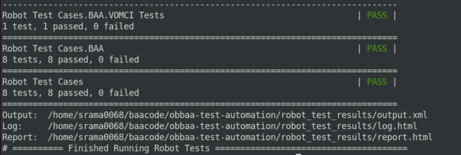

<a id="robot_framework" />

End-to-end automation using Robot framework
=========

## Requirements:
Robot framework and required tools must be installed. Details of the robot framework requirements can be found [here](https://robotframework.org/robotframework/4.1.2/RobotFrameworkUserGuide.html)

- Python 3.8.10 or 3.1.0.6
- Robot framework 4.1.2

## How to Run automated tests using Robot framework
1. Robot fwk and required tools must be installed
2. Checkout the obbaa-test-automation code
3. git clone checkout git@github.com:BroadbandForum/obbaa-test-automation.git
4. checkout to the required branch. (ex. develop branch)
5. Navigate to the obbaa-test-automation directory
6. Run command make run-robot-tests (This will run all the tests in the sequential order)

- the above said make command will trigger the robot framework and it will run all the tests under the folder ~/obbaa-test-automation/robot_test_cases/
- at the end of the run, Results will be placed under ~/obbaa-test-automation/robot_test_results/

 

7. We shall be able to check the logs by opening the log.html file from a web browser.
8. Run Specific tests
- Run command make run-tagged-tests tag=abc(This command will run tests that has the tag named abc)
- This way we need not touch the makefile for running specific test(s)

Note: by default, the docker compose files will pull the develop branch images from(dockerHub). If we want to use the local images to run the tests, we must update the docker-compose file (~/obbaa-test-automation/data/compose_data/docker-compose.yaml) with right image tags and start the test

## Keyword Documentation:
### Pre-requisites: Ensure that obbaa-test-automation repo is checked out

- Documentation of python keywords can be found in
~/obbaa-test-automation/library_files/docs/docker_api.html
~/obbaa-test-automation/library_files/docs/netconf_api.html
- These files are best viewed in the web browsers.

### Updating KW Documentation:
Whenever someone makes any changes to the existing library files (~/obbaa-test-automation/library_files) or adds new files to the directory we must generate the documentation for the keywords.

Example:

~~~
cd obbaa-test-automation/library_files

~/obbaa-test-automation/library_files$ ./generate_kw_documents.sh
~~~
Note: if a new library file is added to the library_files directory, one must update the generate_kw_documents.sh script to include the newly added file.

~~~
#!/bin/bash
libdoc docker_api.py ./docs/docker_api.html
libdoc netconf_api.py ./docs/netconf_api.html

libdoc abc.py ./docs/abc.html ? new entry to be added
~~~
