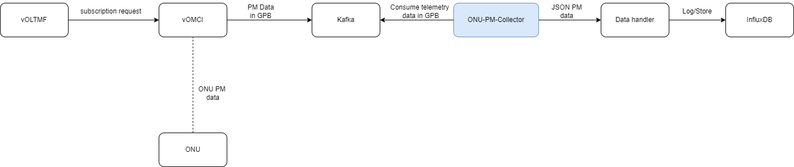
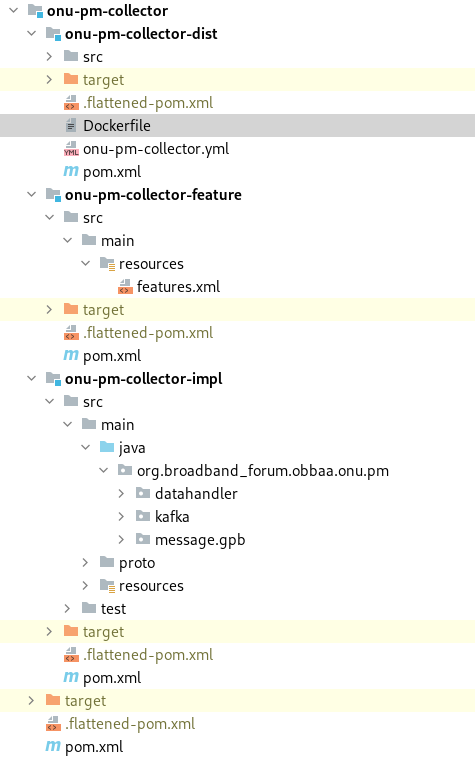

<a id="vonu_telemetry_storage" />

Processing and Storage of vONU Telemetry data
====================

## Introduction
vOLTMF sends a subscription request to vOMCI for collecting ONU's telemetry (PM) data. vOMCI then collects this data periodically from ONU and sends them to the "vomci1-telemetry" KAFKA topic. The ONU Telemetry Collector consumes this data and stores it in influxDB.

## Proposed Design

 

ONU-PM-Collector is a separate docker container which lies under the same network where OBBAA is deployed. It implements a kafka based consumer. It subscribes to the particular topic and starts listening for GPB formatted msg. Once the data is received, it converst GPB to JSON msg. This JSON msg will be converted to time series data (TS data) with the help of Data handler. This TS data will be logged or stored in the influxDB. (bucket-name: onu-pm-collection)

## Kafka
The Kafka topic used for publishing and consuming onu telemetry data is  vomci1-telemetry.

The Kafka topic from which telemetry data is consumed should be configurable through an environment variable.

~~~
KAFKA_TELEMETRY_TOPICS: "vomci1-telemetry"
~~~

## JSON Format
The vOMCI pushes the collected telemetry data for each of the registered subscriptions as a notification as shown below:
~~~
msg {
    header {
        msg_id: "3"
        sender_name: "vomci-vendor-1"
        recipient_name: "vOLTMF"
        object_type: "ONU"
        object_name: "ont1"
    }
    body {
        notification {
            data: <data>
       }
    }
}
~~~
where \<data> is:
~~~
{
    "telemetry-data": {
        "subscription-id": 52,
        "onu-name": "ont1",
        "collection-time": "2021-06-01T15:53:36+00:00",
        "last-message": "true"
        "values": <values>
    }
}
~~~
where \<values> is:
~~~
"ietf-interfaces:interfaces-state":{
   "interface":[     
      {
         "bbf-interfaces-performance-management:performance":{
            "name":"enet1_onu1",
            "type":"iana-if-type:ethernetCsmacd"
            "intervals-15min":{
               "history":[
                  {
                     "interval-number":1,
                     "invalid-data-flag":false,
                     "measured-time":900,
                     "time-stamp":"2020-05-09T15:55:00.000000000Z",
                     "in-broadcast-pkts":7,
                     "in-multicast-pkts":10,
                     "in-octets":11,
                     "out-broadcast-pkts":22,
                     "out-multicast-pkts":25,
                     "out-octets":26
                  }
               ],
               "non-valid-intervals":0,
               "number-of-intervals":1
            }
         }
      }
   ]
}
~~~
## File Structure
The diagram below depicts the structure for onu pm collector. Note the three artifacts (docker:onu-pm-collector-dist, feature:onu-pm-collector-feature, code: onu-pm-collector-impl).

 

## Pre-requisite
### Kafka
Kafka should be up and running with the topic vomci1-telemetry

### InfluxDB
Create bucket in influxDB with the name onu-pm-collection.

Step1. influxDB web GUI (http://127.0.0.1:9999)

Step 2. Bucket (http://127.0.0.1:9999/orgs/2264f8461418bc6a/load-data/buckets)

Step 3. Create bucket with the name onu-pm-collection

## Deploy

~~~
cd ~/obbaa/pm-collector/onu-pm-collector
 
mvn clean install
 
cd ~/obbaa/pm-collector/onu-pm-collector/onu-pm-collector-dist
 
docker build -t onu-pm-collector:latest .
 
docker-compose -f docker-compose.yml up -d
~~~